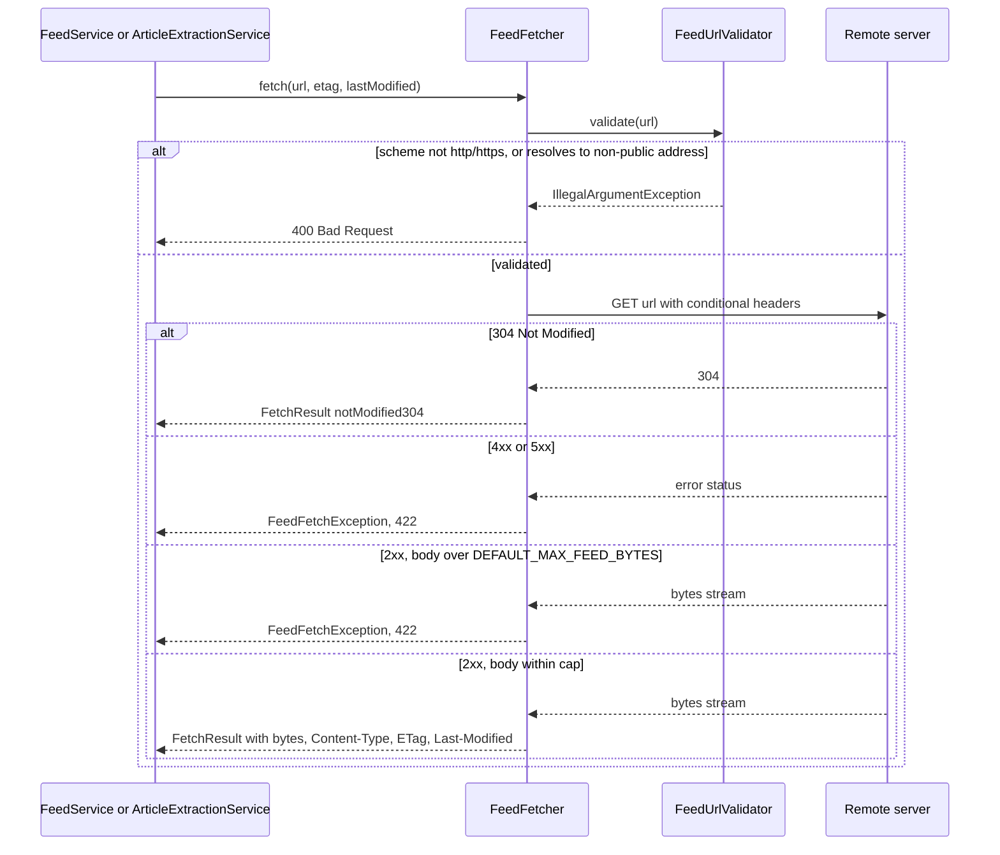

# Architecture Overview

## Backend package structure

Base package: `org.bartram.myfeeder`. Entry point: `MyfeederApplication` (`@EnableScheduling`, `@ConfigurationPropertiesScan`).

```
config/       MyfeederProperties (myfeeder.* config), RestClientConfig (User-Agent customizer), SpaForwardController
model/        Feed, FeedType, Article, Folder, Board, BoardArticle, IntegrationConfig, IntegrationType, UnreadCount
repository/   Spring Data JDBC repositories (one per model), @Query-based custom queries
parser/       FeedParser (ROME for RSS/Atom + Jackson for JSON Feed), ParsedFeed/ParsedArticle records, OpmlFeed/OpmlParseException
service/      FeedService, ArticleService, FeedPollingService, FeedFetcher, FeedUrlValidator, ArticleExtractionService, FolderService, BoardService, RetentionService, OpmlService, OpmlImportService
integration/  RaindropService, RaindropApiClient(Impl), RaindropConfig — see integrations/raindrop.md
event/        FeedSavedEvent, FeedDeletedEvent — after-commit scheduling signals
controller/   REST controllers + typed request records + PaginatedResponse + GlobalExceptionHandler
scheduler/    FeedPollingScheduler — dynamic per-feed polling with backoff
```

This is a classic layered architecture (controller → service → repository), with two cross-cutting mechanisms worth understanding before changing anything: the **event-driven scheduler** (see [Feed Lifecycle Workflow](../workflows/feed-lifecycle.md)) and the **single outbound-fetch path** through `FeedFetcher` (see below) — never issue a raw `RestClient` call to reach a caller-supplied URL.

Persistence uses **Spring Data JDBC, not JPA**: entities use `@Table`/`@Id` from `org.springframework.data.annotation`, there is no lazy loading, and custom queries require `@Query` (no derived query methods). See [Domain Concepts](../domain/concepts.md) for the schema.

## Outbound fetch path: FeedFetcher

`FeedFetcher` (`service/FeedFetcher.java`) is the single component that performs outbound HTTP retrieval of a caller-supplied URL. It is shared by two callers with different jobs but the same trust boundary:

- **Feed polling/subscribe** (`FeedService`, `FeedPollingService` — see [Feed Lifecycle Workflow](../workflows/feed-lifecycle.md)) fetches a feed document, optionally conditional via `If-None-Match`/`If-Modified-Since`, and hands the raw bytes to `FeedParser`.
- **Reader-view extraction** (`ArticleExtractionService`, behind `GET /api/articles/{id}/extracted-content`) fetches an article's original page HTML for Readability-style extraction. See [Reader View Extraction Workflow](../workflows/reader-view-extraction.md) for that pipeline's detail (caching, Jsoup/Readability4J, failure modes) — this page only describes the fetch it depends on.

Both callers go through the same two hardening mechanisms before and during the HTTP call:

1. **SSRF guard (`FeedUrlValidator`)** — runs before every fetch (`FeedFetcher.fetch` calls `urlValidator.validate(url)` first). It requires an `http`/`https` scheme, resolves the host, and rejects any resolved address that is loopback, link-local, RFC1918 site-local, any-local (`0.0.0.0`), multicast, IPv6 unique-local (`fc00::/7`, not covered by `isSiteLocalAddress`), IPv6-mapped-IPv4 wrapping any of the above, or carrier-grade NAT (`100.64.0.0/10`, RFC 6598). This keeps a subscribed feed URL or an article link from steering the server at internal targets (database, in-cluster services, cloud metadata endpoints). A rejection throws `IllegalArgumentException`, mapped to HTTP 400.
   - **Documented, accepted limitations** (single-user LAN deployment — revisit before facing untrusted networks): it is a TOCTOU check — `RestClient` re-resolves the host when it actually connects, so a host whose DNS answer flips between validation and connection (DNS rebinding) can pass validation yet reach a private address; and redirects are not re-validated per hop, so a permitted URL may redirect to a blocked one.
2. **Bounded read (`DEFAULT_MAX_FEED_BYTES` = 10 MiB)** — after a successful response, `FeedFetcher` reads at most `maxFeedBytes + 1` bytes (`readNBytes`); if the body is larger than the cap it throws `FeedFetchException` rather than continuing to read, so a huge or streaming response can't exhaust heap. `FeedFetchException` is also thrown on any 4xx/5xx response. Both are mapped to HTTP 422 by `GlobalExceptionHandler`. A 304 response short-circuits to `FetchResult.notModified304()` without a body read. The size cap is constructor-injectable (a package-private overload), which is how tests exercise the cap without allocating 10 MiB.


*FeedFetcher's request flow: the SSRF guard runs before any network call, and the size cap is enforced while reading the body — both failure paths surface as the exceptions GlobalExceptionHandler maps to 400/422.*

The `RestClient.Builder` `FeedFetcher` receives is the auto-configured Spring Boot bean, so `RestClientConfig`'s customizer applies a `myfeeder/<version> (+https://github.com/bartram/myfeeder)` User-Agent to every outbound fetch (feed polling and reader-view alike).

### FeedParser charset resolution

`FeedParser.parse(rawContent, contentType)` decodes the raw bytes `FeedFetcher` returned before parsing. It first classifies the document as RSS, Atom, or JSON Feed by sniffing the bytes as ISO-8859-1 (which maps every byte to a char, so the ASCII markers `{`, `<feed`, and the Atom namespace URI are found regardless of the document's real encoding), then resolves the charset for XML documents with this precedence:

1. An explicit `charset=` in the `Content-Type` header, if present, wins (HTTP semantics) — ROME's `XmlReader` is constructed in HTTP mode with that content type.
2. Otherwise, ROME's `XmlReader` raw-mode detection applies: BOM first, then the XML prolog's `encoding=` declaration, then UTF-8. (HTTP-mode detection without an explicit charset would fall back to RFC 3023's `us-ascii` default for `text/xml`, mojibaking multi-byte content — raw mode is used specifically to avoid that.)

JSON Feed documents are UTF-8 by spec; Jackson's `ObjectMapper.readTree` auto-detects the UTF family from the byte stream, so no explicit charset handling is needed there. A feed with neither a title nor any parsed articles is treated as a non-feed response (e.g. a rate-limit or error page) and raises `FeedParseException`, mapped to 422.

## Configuration

`MyfeederProperties` (prefix `myfeeder`) binds three groups from `application.yaml`:
- `myfeeder.polling.*` — `default-interval-minutes`, `max-interval-minutes`, `backoff-threshold` (drives [Feed Lifecycle Workflow](../workflows/feed-lifecycle.md))
- `myfeeder.retention.*` — `full-content-days`, `cleanup-cron` (drives `RetentionService`)
- `myfeeder.raindrop.*` — `api-base-url`, `api-token` (env `MYFEEDER_RAINDROP_API_TOKEN`) — see [Raindrop Integration](../integrations/raindrop.md)

## HTTP layer conventions

- `GlobalExceptionHandler` (`@RestControllerAdvice`) maps domain exceptions to `ProblemDetail` responses: `NotFoundException`→404, `IllegalArgumentException`→400, `OpmlParseException`→400, `IllegalStateException`→409, `FeedParseException`/`FeedFetchException`→422, `RaindropNotConfiguredException`→503. Services should throw the specific exception type rather than have controllers catch/translate.
- Request bodies are typed Java records per endpoint (e.g. `FeedUpdateRequest`, `CreateBoardRequest`, `MarkReadRequest`) rather than raw `Map` bodies — this was a deliberate refactor (commit `5136a3e`) to get compile-time binding checks.
- List endpoints return `PaginatedResponse<T>` (`{items, nextCursor}`); see [Domain Concepts](../domain/concepts.md) for the cursor/sort rules that make this correct.
- API surface: `/api/feeds`, `/api/articles`, `/api/integrations`, `/api/opml`, `/api/boards`, `/api/folders`.

## Frontend

`src/main/frontend/` is a React 19 + TypeScript SPA built with Vite.

- **Layout**: three resizable panels — feed tree (`FeedPanel`), article list (`ArticleList`/`BoardArticleList`), reading pane (`ReadingPane`), composed in `App.tsx` under `AppShell`.
- **Data layer**: `src/api/*.ts` are thin fetch wrappers per domain (feeds, articles, folders, boards, integrations, opml, version); `src/hooks/*.ts` wrap them in TanStack Query hooks (`useArticles`, `useFeeds`, `useFolders`, `useBoards`, `useOpml`). `App.tsx` composes route components (`FeedArticles`, `FolderArticles`, `StarredArticles`, `AllArticles`, `BoardArticles`) that each derive TanStack Query filters from Zustand preferences (sort order, hide-read).
- **State**: Zustand stores in `src/stores/` — `uiStore` (selection/focus/panel state) and `preferencesStore` (localStorage-persisted settings: theme, font sizes, sort order, hide-read). `preferencesStore` uses Zustand's `persist`; adding a field with a default does **not** retroactively apply to existing users (see Testing/Gotchas) — needs a `merge` function or version migration.
- **Keyboard shortcuts**: `useKeyboardShortcuts` hook implements vim-style navigation (`j`/`k`/`n`/`p`/`m`/`s`/`o`/`b`/`v`/`r`) plus `g`-prefixed chords (`ga`, `gs`, `gb`) and `+`/`-` font-size adjustment on the focused panel. It resolves the "current article" via `useArticle(selectedArticleId)` (direct fetch by ID) so single-article actions work even on views (Starred/Folder) whose visible list is queried differently from the list this hook receives — a known partial fix (see backlog bug on `j`/`k` navigation).
- **Themes**: 6 themes (3 dark/3 light) in `src/themes.ts`, applied via `useTheme`, persisted in `preferencesStore`.
- **Build/embed**: `npm run build` outputs to `src/main/resources/static/`; the Gradle `npmBuild` task wires this into `./gradlew build` so the SPA ships inside the Spring Boot jar. `SpaForwardController` (in `config/`) forwards non-API routes to the SPA's `index.html` for client-side routing. See [Operations Runbook](../operations/runbook.md) for the full build/deploy sequence — the frontend must be rebuilt with `clean` before every image build or a stale bundle ships.

## Infrastructure dependencies

- **PostgreSQL**: primary datastore, Flyway-migrated (`src/main/resources/db/migration/`), external at `pg.bartram.org` in production (not deployed by the Helm chart — see [Operations Runbook](../operations/runbook.md)).
- **Redis**: backs `@Cacheable` (currently only `RaindropService.listCollections`) via Spring Cache abstraction.
- **Docker**: required locally for both `./gradlew test` (Testcontainers-backed repository/integration tests) and `./gradlew bootRun` (Compose-managed Postgres/Redis). `./gradlew bootTestRun` runs the app itself against Testcontainers-managed services with no external Compose needed.
