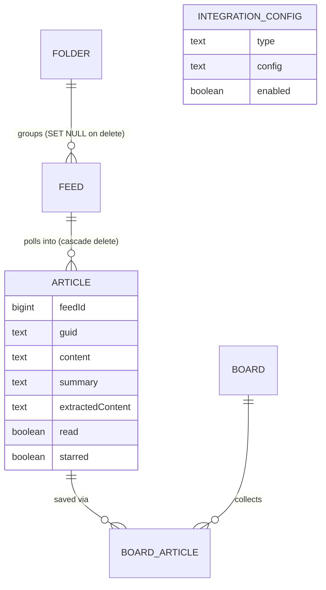

# Domain Concepts

## Entities and schema evolution

Flyway migrations tell the story of how the domain grew:

- **`V1__initial_schema.sql`**: `feed` and `article` tables (core RSS reader), plus `integration_config` (generic key/value integration settings, unique per `type`).
- **`V2__folders_boards_and_feed_folder.sql`**: adds `folder` (feed grouping, with `display_order` for drag-to-reorder) and `board`/`board_article` (curated collections a user saves articles into — see "read later" in `docs/backlog.md`), plus `feed.folder_id`.
- **`V3__article_image_url.sql`**: adds `article.image_url` (thumbnail extracted from feed content).
- **`V4__strip_raindrop_api_token.sql`**: removes a legacy `apiToken` field that used to live inside `integration_config.config` JSON — the token moved to `myfeeder.raindrop.api-token` (env-var-backed config property) instead of being stored in the DB. See [Raindrop Integration](../integrations/raindrop.md). This migration is unusual in that it can't be re-triggered by normal Flyway test startup (see `V4StripRaindropApiTokenMigrationTest` in [Testing Guide](../testing/guide.md) for the pattern used to test it).
- **`V5__article_extracted_content.sql`**: adds `article.extracted_content TEXT` — a cache column for the reader-view feature. It's `NULL` until the first reader-view request for that article, at which point `ArticleExtractionService` populates it (`ArticleRepository.saveExtractedContent`) so subsequent requests skip the fetch/parse. It's aged out alongside `content` by `RetentionService` (no separate lifecycle/cron of its own — see [Feed Lifecycle Workflow](../workflows/feed-lifecycle.md) for the retention job).

*Core schema relationships: a feed's articles cascade-delete with it, a folder's feeds are ungrouped (not deleted) when the folder goes away, and boards collect articles through the `board_article` join table. `IntegrationConfig` stands alone (no FK to the other entities).*

### `Feed` (`model/Feed.java` / table `feed`)
Tracks a subscribed source: `url`, `title`, `description`, `siteUrl`, `feedType` (RSS/Atom/JSON — `FeedType` enum), `pollIntervalMinutes`, `folderId`, and **poll health state**: `lastPolledAt`, `lastSuccessfulPollAt`, `errorCount`, `lastError`, `etag`, `lastModifiedHeader`. The last four fields exist purely to support conditional GETs and backoff — see [Feed Lifecycle Workflow](../workflows/feed-lifecycle.md).

### `Article` (`model/Article.java` / table `article`)
One article from a feed: `feedId` (FK, cascade delete), `guid` (dedup key, unique with `feedId`), `title`, `url`, `author`, `content`, `summary`, `imageUrl`, `publishedAt`, `fetchedAt`, `read`, `starred`. All fields are non-nullable *by DB constraint* only for `feedId`/`guid`/`title`/`url`/`fetchedAt`/`read`/`starred` (`V1__initial_schema.sql`); `author`, `content`, `summary`, `imageUrl`, `publishedAt` are nullable.

`content` gets nulled out by `RetentionService.cleanupOldContent()` (`ArticleRepository.clearContentOlderThan`) once `fetchedAt` is older than `full-content-days`. **Note:** `summary` is *not* touched by this cleanup — only `content` and `extracted_content` are cleared (`clearContentOlderThan`'s `UPDATE` statement sets just those two columns), so don't assume `summary` ages out the same way.

**`extractedContent` (reader view cache, column `article.extracted_content`, added in V5):** unlike the other columns above, this is **not** a mapped field on the `Article` entity (`model/Article.java`) — it's read and written exclusively through two dedicated `ArticleRepository` queries, `findExtractedContent(Long id)` (returns `null` if nothing is cached or the article doesn't exist) and `saveExtractedContent(Long id, String content)`, so a plain `articleRepository.save(article)`/`findById` round-trip never touches it. It holds the cached readable-HTML result of a reader-view extraction, populated on first request and cleared by the same retention sweep that clears `content`. See [Architecture Overview](../architecture/overview.md#reader-view-articleextractionservice) for how the content is produced: `ArticleExtractionService` fetches the article's original page through `FeedFetcher` (to reuse the SSRF guard, size cap, and User-Agent), decodes it with jsoup (header charset if declared, else jsoup's BOM/meta-tag detection), parses it with Readability4J, and caches the resulting HTML on first successful extraction. Failure modes surfaced from `GET /api/articles/{id}/extracted-content`: 404 if the article doesn't exist, 400 if it has no `url`, and 422 if the page fetch or the extraction itself fails.

**Sort order rule (important, easy to get wrong):** articles are sorted by `COALESCE(published_at, fetched_at)`, **not** by `id`. Batch-fetched articles (e.g. from a bulk OPML import or a feed with a backlog of items) get sequential DB IDs but widely varied publication dates, so `ORDER BY id` does not produce chronological order. Cursor pagination therefore uses a composite `(published_at, id)` comparison — `ArticleController`/`ArticleService` still expose a single article ID as the cursor, but the service looks up that cursor article's date to build the SQL comparison.

**Pagination shape:** all list endpoints return `PaginatedResponse<T>` (`{items, nextCursor}` — the field is `items`, not `articles`). Controllers fetch `limit + 1` rows and delegate the "does another page exist / trim the extra row" logic to `PaginatedResponse.of(fetched, limit, idExtractor)` (see `controller/PaginatedResponse.java`) — don't reimplement that trimming logic per-controller.

**Reading pane fetch-by-ID:** the reading pane fetches the selected article directly via `GET /api/articles/{id}` (`useArticle(id)`), not by searching the paginated list query client-side. This avoids the reading pane and the article list disagreeing about filters/sort — a pattern also leaned on by `useKeyboardShortcuts` (see [Architecture Overview](../architecture/overview.md)) to resolve the "current article" on views where the visible list and the hook's list diverge.

### `Folder` (`model/Folder.java` / table `folder`)
A named grouping of feeds with a user-controlled `displayOrder` (drag-to-reorder in the sidebar, `c47a2a0`/`4cc1a1b`). A feed's `folderId` is nullable (`ON DELETE SET NULL`), so deleting a folder ungroups its feeds rather than deleting them.

### `Board` / `BoardArticle` (`model/Board.java`, `BoardArticle.java` / tables `board`, `board_article`)
A board is a named, user-created collection (e.g. "Read Later"); `board_article` is the join table (`UNIQUE(board_id, article_id)` — adding the same article twice is a no-op, see `BoardService.addArticle`). `BoardService.getOrCreateByName` backs the "Read Later" quick-action so it doesn't need a separate creation step in the UI.

### `IntegrationConfig` (`model/IntegrationConfig.java` / table `integration_config`)
Generic per-integration settings row (`type` unique, JSON `config` blob, `enabled` flag). Currently the only consumer is Raindrop.io — see [Raindrop Integration](../integrations/raindrop.md) for how `RaindropConfig` is deserialized from the `config` column and how the token itself is deliberately **not** stored here (V4 migration).

## API surface (by domain)

| Domain | Controller | Base path |
|---|---|---|
| Feed | `FeedController` | `/api/feeds` |
| Article | `ArticleController` | `/api/articles` |
| Folder | `FolderController` | `/api/folders` |
| Board | `BoardController` | `/api/boards` |
| Integration | `IntegrationConfigController` | `/api/integrations` |
| OPML | `OpmlController` | `/api/opml` |

Request bodies are typed records per action (e.g. `FeedUpdateRequest`, `CreateBoardRequest`, `MoveFeedToFolderRequest`, `ArticleStateRequest`, `MarkReadRequest`) rather than raw `Map` — see [Architecture Overview](../architecture/overview.md) for the HTTP-layer conventions and exception-to-status mapping shared by all these controllers.

`GET /api/articles/{id}/extracted-content` is the reader-view endpoint: it doesn't return the `Article` shape but an `ExtractedContent` record (`title`, `contentHtml`), backed by the cache described above.

## Business rules worth remembering

- **Article dedup key is `(feed_id, guid)`**, enforced at the DB level and checked in `FeedPollingService` before insert.
- **`read`/`starred` are independent booleans**, both patchable via `PATCH /api/articles/{id}` (`ArticleStateRequest`). "Mark read" also supports bulk operations by article ID list, by feed, or by "older than N days" (`MarkReadRequest` — see `docs/backlog.md` for the UI preset days: 1/3/7/14).
- **OPML import** (`OpmlService` + `OpmlImportService`) has explicit XXE protection in the XML parser — preserve this if you touch `OpmlService`'s parsing code. Import matches existing feeds by URL (update in place) and folders by case-insensitive name (create if missing); only newly created feeds publish `FeedSavedEvent`.
