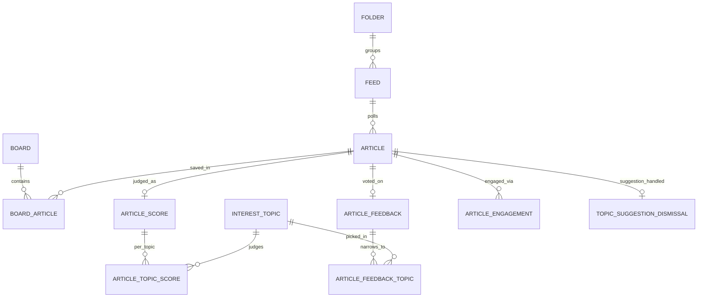

# Domain Concepts

## Entities and schema evolution

Flyway migrations tell the story of how the domain grew:

- **`V1__initial_schema.sql`**: `feed` and `article` tables (core RSS reader), plus `integration_config` (generic key/value integration settings, unique per `type`).
- **`V2__folders_boards_and_feed_folder.sql`**: adds `folder` (feed grouping, with `display_order` for drag-to-reorder) and `board`/`board_article` (curated collections a user saves articles into — see "read later" in `docs/backlog.md`), plus `feed.folder_id`.
- **`V3__article_image_url.sql`**: adds `article.image_url` (thumbnail extracted from feed content).
- **`V4__strip_raindrop_api_token.sql`**: removes a legacy `apiToken` field that used to live inside `integration_config.config` JSON — the token moved to `myfeeder.raindrop.api-token` (env-var-backed config property) instead of being stored in the DB. See [Raindrop Integration](../integrations/raindrop.md). This migration is unusual in that it can't be re-triggered by normal Flyway test startup (see `V4StripRaindropApiTokenMigrationTest` in [Testing Guide](../testing/guide.md) for the pattern used to test it).
- **`V5__article_extracted_content.sql`**: adds `article.extracted_content`, a cache of the reader-view content extracted from the article's original page (`ArticleExtractionService`, `GET /api/articles/{id}/extracted-content`). `RetentionService.cleanupOldContent` (a scheduled job driven by `myfeeder.retention.cleanup-cron`/`full-content-days`) nulls out `content` and `extracted_content` together once an article ages past the retention window; `summary` is left untouched so list/preview text survives retention.
- **`V6__interest_scoring.sql`**: the complete v0.2.1 interest-ranking schema in one migration — `interest_profile` (singleton rubric header), `interest_topic` (rubric lines), `article_score`/`article_topic_score` (Jev's judgment of one article), and `article_feedback`/`article_feedback_topic` (the user's thumbs vote). See [Interest Scoring Workflow](../workflows/interest-scoring.md) for the scoring pipeline and the blended-score math.
- **`V7__engagement.sql`**: the v0.3.0 schema — `article_engagement` (passive signals: opening, starring, boarding, Raindrop-saving an article) and `topic_suggestion_dismissal` (gap-discovery bookkeeping). See [Interest Scoring Workflow](../workflows/interest-scoring.md) for how engagement feeds the learned-weight model and how suggestions are generated.

### `Feed` (`model/Feed.java` / table `feed`)
Tracks a subscribed source: `url`, `title`, `description`, `siteUrl`, `feedType` (RSS/Atom/JSON — `FeedType` enum), `pollIntervalMinutes`, `folderId`, and **poll health state**: `lastPolledAt`, `lastSuccessfulPollAt`, `errorCount`, `lastError`, `etag`, `lastModifiedHeader`. The last four fields exist purely to support conditional GETs and backoff — see [Feed Lifecycle Workflow](../workflows/feed-lifecycle.md).

### `Article` (`model/Article.java` / table `article`)
One article from a feed: `feedId` (FK, cascade delete), `guid` (dedup key, unique with `feedId`), `title`, `url`, `author`, `content`, `summary`, `imageUrl`, `publishedAt`, `fetchedAt`, `read`, `starred`, and (since V5) `extracted_content`. `content` and `extracted_content` get nulled out together by `RetentionService` once `fetched_at` ages past `full-content-days`; `summary` is deliberately left alone so article previews keep working after retention runs (see the V5 entry above). Four `@Transient` fields are joined in at read time rather than stored on the row — `interestScore`, `interestBreakdown`, `feedback`, and `engagement` — covered under "Interest-ranking entities" and "Engagement" below.

**Sort order rule (important, easy to get wrong):** articles are sorted by `COALESCE(published_at, fetched_at)`, **not** by `id`. Batch-fetched articles (e.g. from a bulk OPML import or a feed with a backlog of items) get sequential DB IDs but widely varied publication dates, so `ORDER BY id` does not produce chronological order. Cursor pagination therefore uses a composite `(published_at, id)` comparison — `ArticleController`/`ArticleService` still expose a single article ID as the cursor, but the service looks up that cursor article's date to build the SQL comparison.

**Pagination shape:** all list endpoints return `PaginatedResponse<T>` (`{items, nextCursor}` — the field is `items`, not `articles`). Controllers fetch `limit + 1` rows and delegate the "does another page exist / trim the extra row" logic to `PaginatedResponse.of(fetched, limit, idExtractor)` (see `controller/PaginatedResponse.java`) — don't reimplement that trimming logic per-controller.

**Reading pane fetch-by-ID:** the reading pane fetches the selected article directly via `GET /api/articles/{id}` (`useArticle(id)`), not by searching the paginated list query client-side. This avoids the reading pane and the article list disagreeing about filters/sort — a pattern also leaned on by `useKeyboardShortcuts` (see [Architecture Overview](../architecture/overview.md)) to resolve the "current article" on views where the visible list and the hook's list diverge.

### `Folder` (`model/Folder.java` / table `folder`)
A named grouping of feeds with a user-controlled `displayOrder` (drag-to-reorder in the sidebar, `c47a2a0`/`4cc1a1b`). A feed's `folderId` is nullable (`ON DELETE SET NULL`), so deleting a folder ungroups its feeds rather than deleting them.

### `Board` / `BoardArticle` (`model/Board.java`, `BoardArticle.java` / tables `board`, `board_article`)
A board is a named, user-created collection (e.g. "Read Later"); `board_article` is the join table (`UNIQUE(board_id, article_id)` — adding the same article twice is a no-op, see `BoardService.addArticle`). `BoardService.getOrCreateByName` backs the "Read Later" quick-action so it doesn't need a separate creation step in the UI.

### `IntegrationConfig` (`model/IntegrationConfig.java` / table `integration_config`)
Generic per-integration settings row (`type` unique, JSON `config` blob, `enabled` flag). Currently the only consumer is Raindrop.io — see [Raindrop Integration](../integrations/raindrop.md) for how `RaindropConfig` is deserialized from the `config` column and how the token itself is deliberately **not** stored here (V4 migration).

## Interest-ranking entities (V6)

These tables are the rubric and the judgments it produces — the schema side of [Interest Scoring Workflow](../workflows/interest-scoring.md), which owns the scoring pipeline, the Jev request/response shape, and the learned-weight math. This page only documents what is stored and the invariants around storing it.

### `InterestProfile` (`model/InterestProfile.java` / table `interest_profile`)
A **singleton** row (`id` is `CHECK (id = 1)`, pre-seeded by V6 so it is always `UPDATE`-able rather than needing an insert-or-update dance). `profileText` is the free-text profile question judged by Jev; `version` is a plain counter column (not optimistic-locking) that the service bumps only when `profileText` actually changes — a save that doesn't change the text leaves `version` alone.

### `InterestTopic` (`model/InterestTopic.java` / table `interest_topic`)
One rubric line: `name` is a short display label (chip text) that is **never sent to Jev**; `description` is the text that *is* sent and that Jev's Noul question judges; `weight` is a point value constrained to **-50..+50** (`CHECK (weight BETWEEN -50 AND 50)`). Like the profile, `version` is a plain counter bumped only when `description` changes — a name- or weight-only edit keeps the same version.

### `ArticleScore` / `ArticleTopicScore` (table `article_score` / `article_topic_score`)
`article_score` is a one-row-per-judged-article record of the blended-score inputs and the scoring attempt state: `status` is one of `SCORED` (write-once — a FAILED row can be overwritten by a SCORED one, but never a SCORED or SKIPPED row), `FAILED` (retried up to `ArticleScoreStore.MAX_ATTEMPTS = 3`, tracked via `attempts`/`last_error`), or `SKIPPED` (terminal, e.g. no GUID or no judgeable text). `profile_score`/`profile_max_level`/`profile_confidence`/`profile_version` capture the profile question's answer (null when the rubric had no profile question that call). `article_topic_score` is its child table (`ON DELETE CASCADE` from `article_score`, so deleting a score row — e.g. for Re-score — removes its topic judgments too), one row per `(article_id, topic_id)` holding the raw noul (`CHECK (noul BETWEEN 0 AND 1)`) and the `topic_version` the judgment was made against.

**Version-check invariant:** `ArticleScoringService` snapshots the profile and every topic's version *before* calling Jev (a call can take ~90s with retries). If the profile's version or any topic's version changed by the time the call returns — e.g. the rubric was edited mid-call — the service **discards the judgment and writes nothing** (no score, no failed attempt) rather than persisting a score against a stale rubric; the article is left for the sweep to re-pick against the current rubric.

### `ArticleFeedback` / `ArticleFeedbackTopic` (table `article_feedback` / `article_feedback_topic`)
The user's thumbs vote on one article: `article_feedback` has `vote` (`CHECK (vote IN (-1, 1))`, one row per article, `ON DELETE CASCADE` from `article`) and `topics_narrowed`, a flag for whether the vote was narrowed to specific topics the user picked. When `topics_narrowed` is true, only the child `article_feedback_topic` rows (no `CHECK` ties them to the vote direction) count toward the learned-weight model, and zero picked rows deliberately penalizes nothing rather than falling back to "all topics". See [Interest Scoring Workflow](../workflows/interest-scoring.md) for how votes turn into a per-topic learned adjustment.

## Engagement and gap-discovery entities (V7)

### `ArticleEngagement` (`repository/ArticleEngagementStore.java` / table `article_engagement`)
One **sticky** row per `(article_id, kind)`, `kind` one of `OPEN_ORIGINAL`, `STAR`, `BOARD`, `RAINDROP` (`EngagementKind` enum; its declaration order is also the API/display order). `ArticleEngagementStore.recordQuietly` is the capture entry point used by the article-opening, starring, board-adding, and Raindrop-saving code paths: it calls the plain `record` (an idempotent `INSERT ... ON CONFLICT DO NOTHING`, so an `(article, kind)` row keeps its first `created_at` even if the same engagement happens again) but **catches and logs any `DataAccessException` instead of propagating it**, and opens no transaction of its own — every call autocommits independently, so a failed engagement insert can never abort or roll back the user's save (star, board-add, Raindrop-save) that triggered it.

Engagement is sticky by design: un-starring an article, removing it from a board, or deleting the board itself all leave its `article_engagement` rows untouched (there is no un-record operation reachable from those paths) — only `DELETE /api/articles/{id}/engagement` (`ArticleService.forgetEngagement`) clears them, and it removes every kind at once with no per-kind selectivity. Deleting the article (`ON DELETE CASCADE` from `article`) or its feed (cascading through `article`) removes its engagement rows. `GET /api/articles/{id}` (`ArticleService.findByIdWithBreakdown`) sets `Article.engagement` to the article's kinds (`[]` when there are none); every list endpoint (`GET /api/articles`, `/api/articles/priority`, board article lists) omits the field entirely (it is `@Transient` and `@JsonInclude(NON_NULL)`, left `null`), so engagement is a detail-view-only payload.

### `TopicSuggestion` / `topic_suggestion_dismissal` (`repository/TopicSuggestionStore.java` / table `topic_suggestion_dismissal`)
Gap discovery surfaces engaged-but-poorly-matched articles as candidate topics to create. `TopicSuggestionStore` is the **only reader and only writer** of `topic_suggestion_dismissal` — `InterestScoreQueries`'s ranking/blend SQL never references it (enforced by a dedicated V7 migration test), so dismissing a suggestion can never change an article's interest score. A suggestion is handled by inserting one row keyed by `article_id` with `reason` either `DISMISSED` (the user dismissed it, `SuggestionDismissalReason.DISMISSED`) or `TOPIC_CREATED` (a topic was saved with that article as its `sourceArticleId`, `SuggestionDismissalReason.TOPIC_CREATED`). **The two reasons are mutually exclusive terminal states**: the insert is `ON CONFLICT (article_id) DO NOTHING`, so whichever reason is recorded first wins and sticks — there is no un-dismiss and no way to move from one reason to the other. The table has no column referencing `interest_topic`, so deleting a topic never touches a dismissal row.

## Schema overview

*The core reader schema (`FEED`/`ARTICLE`/`FOLDER`/`BOARD`, left) and the interest/engagement schema added in V6-V7 (right), both keyed off `ARTICLE`. `INTEREST_PROFILE` and `INTEGRATION_CONFIG` are singleton/standalone tables with no foreign keys and are omitted for clarity.*

## API surface (by domain)

| Domain | Controller | Base path |
|---|---|---|
| Feed | `FeedController` | `/api/feeds` |
| Article | `ArticleController` | `/api/articles` |
| Folder | `FolderController` | `/api/folders` |
| Board | `BoardController` | `/api/boards` |
| Integration | `IntegrationConfigController` | `/api/integrations` |
| OPML | `OpmlController` | `/api/opml` |
| Interest (profile, topics, preview, rescore, status, suggestions) | `InterestController`, `InterestPreviewController`, `InterestRescoreController`, `InterestStatusController`, `TopicSuggestionController` | `/api/interest` |

The `/api/interest` base path is shared by five single-purpose controller beans rather than one large controller — `InterestController` for `/profile` and `/topics` CRUD, `InterestPreviewController` for `/preview`, `InterestRescoreController` for `/rescore`, `InterestStatusController` for `/status`, and `TopicSuggestionController` for `/suggestions` — so each slice can be tested and reasoned about independently. Article-level interest actions (thumbs feedback, engagement) live on `ArticleController` instead, under `/api/articles/{id}/feedback` and `/api/articles/{id}/engagement`, because they key off an article rather than the rubric. See [Interest Scoring Workflow](../workflows/interest-scoring.md) for what each endpoint does.

Request bodies are typed records per action (e.g. `FeedUpdateRequest`, `CreateBoardRequest`, `MoveFeedToFolderRequest`, `ArticleStateRequest`, `MarkReadRequest`, `TopicRequest`, `FeedbackRequest`, `RescoreRequest`) rather than raw `Map` — see [Architecture Overview](../architecture/overview.md) for the HTTP-layer conventions and exception-to-status mapping shared by all these controllers.

## Business rules worth remembering

- **Article dedup key is `(feed_id, guid)`**, enforced at the DB level and checked in `FeedPollingService` before insert.
- **`read`/`starred` are independent booleans**, both patchable via `PATCH /api/articles/{id}` (`ArticleStateRequest`). "Mark read" also supports bulk operations by article ID list, by feed, or by "older than N days" (`MarkReadRequest` — see `docs/backlog.md` for the UI preset days: 1/3/7/14).
- **OPML import** (`OpmlService` + `OpmlImportService`) has explicit XXE protection in the XML parser — preserve this if you touch `OpmlService`'s parsing code. Import matches existing feeds by URL (update in place) and folders by case-insensitive name (create if missing); only newly created feeds publish `FeedSavedEvent`.
- **`Article.interestScore`/`interestBreakdown`/`feedback`/`engagement` are all `@Transient`**: they're never columns on `article`, always computed by joining `InterestScoreQueries`, `ArticleFeedbackStore`, and `ArticleEngagementStore` at read time, and all four are `@JsonInclude(NON_NULL)` so they silently disappear from JSON rather than serializing as `null` when a code path doesn't populate them. `interestBreakdown`, `feedback`, and `engagement` are populated only by `GET /api/articles/{id}`; list endpoints populate `interestScore` alone.
- **Interest-scoring and engagement writes never touch `read`/`starred`**: `ArticleScoreStore` only ever writes/deletes `article_score` and `article_topic_score`, and `ArticleEngagementStore`/`TopicSuggestionStore` only ever write their own tables — none of the interest-ranking machinery can change an article's read or starred state or delete an article.
