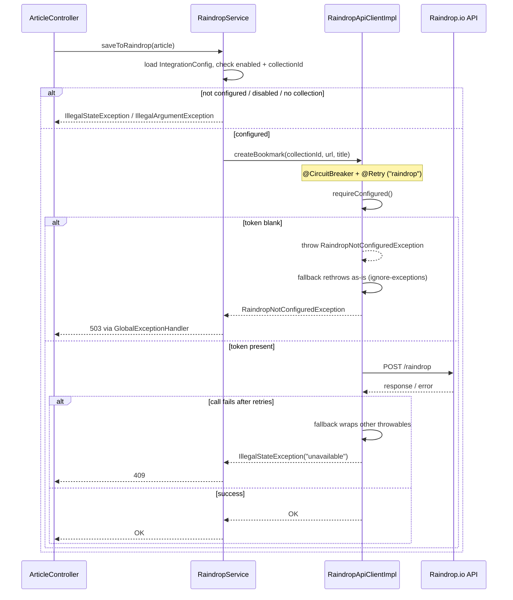

# Raindrop.io Integration

Raindrop.io is a bookmarking service. myfeeder lets a user push a saved `Article` into a chosen Raindrop collection via `POST /api/articles/{id}/raindrop`. This is the only outbound third-party integration currently implemented (Dropbox/Google Drive export is backlog-only — see `docs/backlog.md` and the Quickstart backlog).

## Why the code is split into `RaindropService` + `RaindropApiClientImpl`

This split exists specifically so that **business validation runs outside the circuit breaker** and only the real HTTP call is wrapped:

- **`RaindropService`** (in `integration/`, but the business-rule layer) looks up the `IntegrationConfig` row for `IntegrationType.RAINDROP`, checks `enabled`, deserializes `RaindropConfig` (which holds the selected `collectionId`), and throws `IllegalStateException` (not configured/disabled, →409) or `IllegalArgumentException` (no collection picked, →400) *before* ever calling the API client. It also exposes `listCollections()`, cached via `@Cacheable("raindrop-collections")` (Spring Cache backed by Redis, via `spring-boot-starter-data-redis` + `spring-boot-starter-cache`), so the Settings UI's collection picker doesn't hit Raindrop's API on every render. Both `saveToRaindrop(Article)` and `listCollections()` delegate to the injected `RaindropApiClient` interface rather than calling `RaindropApiClientImpl` directly.
- **`RaindropApiClientImpl`** (implements `RaindropApiClient`) owns the actual `RestClient` calls (`listCollections`, `createBookmark`) and carries the `@CircuitBreaker(name = "raindrop", fallbackMethod = ...)` + `@Retry(name = "raindrop")` annotations directly on each public method. This is a **separate Spring bean** deliberately: Resilience4j's annotations are AOP-proxy-based, so if `RaindropService` called an annotated method on *itself* (self-invocation), the proxy — and the resilience behavior — would be bypassed. Putting the annotated methods on a distinct bean that `RaindropService` calls through avoids that trap.

**Convention for future external integrations:** follow this same pattern — `@CircuitBreaker`/`@Retry` on the API-client bean, not the service, with business-rule checks happening in the service before the client call.



## The fallback rethrow trap (and why it matters)

Resilience4j's `@CircuitBreaker` fallback method wraps *any* throwable reaching it into a generic error by default. `RaindropApiClientImpl`'s fallback methods (`listCollectionsFallback`, `createBookmarkFallback`) explicitly `instanceof`-check for `RaindropNotConfiguredException` and rethrow it as-is — because that exception must reach `GlobalExceptionHandler` and become a 503 (`handleRaindropNotConfigured`), not get papered over as a 409 "circuit breaker opened" error. Everything else gets wrapped as `IllegalStateException("Raindrop.io is currently unavailable", throwable)`, which `GlobalExceptionHandler.handleIllegalState` maps to 409.

For this rethrow to actually take effect, `RaindropNotConfiguredException` is also listed under `ignore-exceptions` for **both** the circuit breaker and retry instances in `application.yaml` — otherwise a simply-unconfigured token would count as a "failure," open the breaker, and burn retry attempts for no reason:

```yaml
resilience4j:
  circuitbreaker:
    instances:
      raindrop:
        failure-rate-threshold: 50
        wait-duration-in-open-state: 30s
        permitted-number-of-calls-in-half-open-state: 3
        sliding-window-type: COUNT_BASED
        sliding-window-size: 10
        minimum-number-of-calls: 5
        ignore-exceptions:
          - org.bartram.myfeeder.integration.RaindropNotConfiguredException
  retry:
    instances:
      raindrop:
        max-attempts: 3
        wait-duration: 1s
        exponential-backoff-multiplier: 2
        ignore-exceptions:
          - org.bartram.myfeeder.integration.RaindropNotConfiguredException
```

The same `application.yaml` also sets a global HTTP client timeout (`spring.http.client.connect-timeout` / `read-timeout`) that applies to the auto-configured `RestClient.Builder` used by `RaindropApiClientImpl`, bounding how long a slow Raindrop response can tie up a request/scheduler thread before the circuit breaker or retry logic even gets a chance to react.

## Configuration and secret handling

The Raindrop **API token is a config property, not a DB value**: `myfeeder.raindrop.api-token` binds to env var `MYFEEDER_RAINDROP_API_TOKEN` (default empty string) via `MyfeederProperties.Raindrop`, alongside `myfeeder.raindrop.api-base-url` (default `https://api.raindrop.io/rest/v1`). An earlier design stored the token inside `integration_config.config`'s JSON blob; a Flyway migration removed that column (see [Domain Concepts](../domain/concepts.md)) — don't reintroduce that pattern. `RaindropApiClientImpl.requireConfigured()` throws `RaindropNotConfiguredException` whenever the token is blank, which is the trigger for the whole ignore-exceptions/rethrow chain above. `IntegrationConfigController.raindropStatus()` (`GET /api/integrations/raindrop/status`) exposes whether the token is configured, independent of whether the `IntegrationConfig` row's `enabled` flag or `collectionId` are set — the Settings UI uses this to distinguish "token missing" from "collection not picked."

In deployment, the token flows: local env var → `deploy.sh` (`MYFEEDER_RAINDROP_API_TOKEN`, optional — a warning is printed if unset, integration is simply disabled) → Helm `--set secrets.raindropApiToken` → chart secret. See [Operations Runbook](../operations/runbook.md).

## Testing this integration

`RaindropServiceTest` is a plain Mockito unit test (no Spring context) covering the business-rule layer: not-configured, disabled, no-collection-selected, successful delegation to `RaindropApiClient`, and the case-insensitive sort in `listCollections()`. Because it runs outside a Spring context, it does not exercise the `@Cacheable` proxy behavior itself. `RaindropApiClientImplTest` uses `MockRestServiceServer` to cover the HTTP client — request URL/headers/body shape for both `listCollections` and `createBookmark` — and the token-missing path that throws `RaindropNotConfiguredException` before any HTTP call is made. See [Testing Guide](../testing/guide.md).
