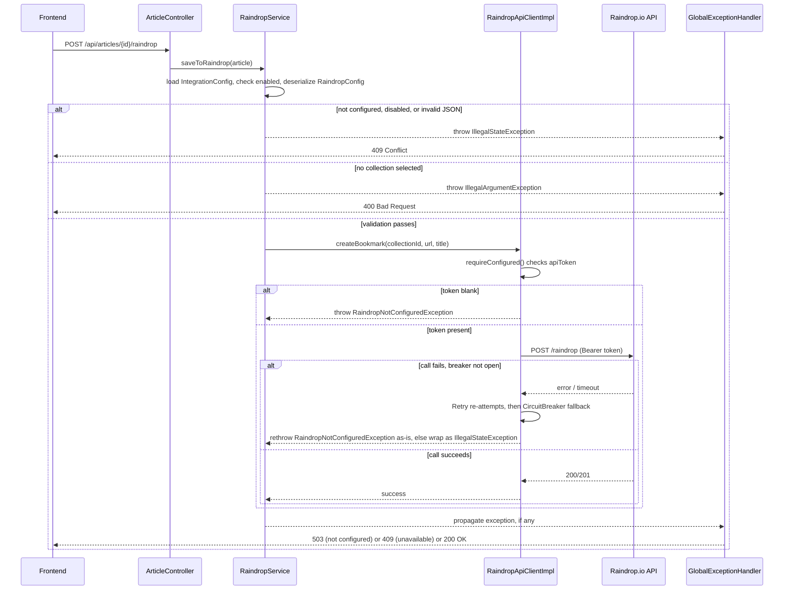

# Raindrop.io Integration

Raindrop.io is a bookmarking service. myfeeder lets a user push a saved `Article` into a chosen Raindrop collection via `POST /api/articles/{id}/raindrop`. This is the only outbound third-party integration currently implemented (Dropbox/Google Drive export is backlog-only — see the "Dropbox and Google Drive" section of `docs/backlog.md`, which lists auto-export of saved articles/feed list/history as unstarted items).

`IntegrationConfigController` (`/api/integrations/...`) exposes the supporting endpoints: `GET /raindrop/status` (whether a token is configured), `GET /raindrop/collections` (the name-sorted collection picker), `PUT /raindrop` (upsert the selected `collectionId`), and `DELETE /raindrop`. The actual bookmark-creation trigger lives on `ArticleController` as `POST /api/articles/{id}/raindrop`, which loads the `Article` and delegates to `RaindropService.saveToRaindrop`.

## Why the code is split into `RaindropService` + `RaindropApiClientImpl`

This split (commit `2e33949`, "move Raindrop resilience annotations to the API client") exists specifically so that **business validation runs outside the circuit breaker** and only the real HTTP call is wrapped:

- **`RaindropService`** (in `integration/`, but the business-rule layer) looks up the `IntegrationConfig` row for `IntegrationType.RAINDROP`, checks `enabled`, deserializes `RaindropConfig` (which holds the selected `collectionId`), and throws `IllegalStateException` (not configured/disabled, →409) or `IllegalArgumentException` (no collection picked, →400) *before* ever calling the API client. It also exposes `listCollections()`, cached via `@Cacheable("raindrop-collections")` (backed by Redis), so the Settings UI's collection picker doesn't hit Raindrop's API on every render.
- **`RaindropApiClientImpl`** (implements `RaindropApiClient`) owns the actual `RestClient` calls (`listCollections`, `createBookmark`) and carries the `@CircuitBreaker(name = "raindrop")` + `@Retry(name = "raindrop")` annotations. This is a **separate Spring bean** deliberately: Resilience4j's annotations are AOP-proxy-based, so if `RaindropService` called an annotated method on *itself* (self-invocation), the proxy — and the resilience behavior — would be bypassed. Putting the annotated methods on a distinct bean that `RaindropService` calls through avoids that trap.

**Convention for future external integrations:** follow this same pattern — `@CircuitBreaker`/`@Retry` on the API-client bean, not the service, with business-rule checks happening in the service before the client call.

## Request flow


Request path from the frontend down to Raindrop.io, showing where circuit breaker/retry/fallback sit relative to `RaindropService`'s business-rule checks.

## The fallback rethrow trap (and why it matters)

Resilience4j's `@CircuitBreaker` fallback method wraps *any* throwable reaching it into a generic 5xx by default. `RaindropApiClientImpl`'s fallback methods (`listCollectionsFallback`, `createBookmarkFallback`) explicitly `instanceof`-check for `RaindropNotConfiguredException` and rethrow it as-is (documented at the call site, commit `86d7008`) — because that exception must reach `GlobalExceptionHandler` and become a 503, not get papered over as a 409 "circuit breaker opened" error. Everything else gets wrapped as `IllegalStateException("Raindrop.io is currently unavailable", throwable)` → 409.

For this rethrow to actually take effect, `RaindropNotConfiguredException` is also listed under `ignore-exceptions` for **both** the circuit breaker and retry instances in `application.yaml` — otherwise a simply-unconfigured token would count as a "failure," open the breaker, and burn retry attempts for no reason:

```yaml
resilience4j:
  circuitbreaker:
    instances:
      raindrop:
        failure-rate-threshold: 50
        wait-duration-in-open-state: 30s
        permitted-number-of-calls-in-half-open-state: 3
        sliding-window-type: COUNT_BASED
        sliding-window-size: 10
        minimum-number-of-calls: 5
        ignore-exceptions:
          - org.bartram.myfeeder.integration.RaindropNotConfiguredException
  retry:
    instances:
      raindrop:
        max-attempts: 3
        wait-duration: 1s
        exponential-backoff-multiplier: 2
        ignore-exceptions:
          - org.bartram.myfeeder.integration.RaindropNotConfiguredException
```

`GlobalExceptionHandler` maps `RaindropNotConfiguredException` → 503 ("Raindrop not configured"), `IllegalStateException` → 409 ("Configuration error"), and `IllegalArgumentException` → 400 ("Bad Request"), which is what makes the status codes described above concrete.

## Configuration and secret handling

The Raindrop **API token is a config property, not a DB value**: `myfeeder.raindrop.api-token` binds to env var `MYFEEDER_RAINDROP_API_TOKEN` (see `MyfeederProperties.Raindrop`, defaulting to empty when unset). `V4__strip_raindrop_api_token.sql` (see [Domain Concepts](../domain/concepts.md)) removed an earlier design where the token lived inside `integration_config.config`'s JSON blob — don't reintroduce that; the JSON now only carries `{ collectionId }`. `RaindropApiClientImpl.requireConfigured()` throws `RaindropNotConfiguredException` whenever the token is blank, which is the trigger for the whole ignore-exceptions/rethrow chain above. `IntegrationConfigController.raindropStatus()` also reads the same property directly to answer `GET /api/integrations/raindrop/status` without touching the circuit breaker.

In deployment, the token flows: local env var → `deploy.sh` (`MYFEEDER_RAINDROP_API_TOKEN`, optional — a warning is printed if unset, integration is simply disabled) → Helm `--set secrets.raindropApiToken` → chart `Secret` key `myfeeder-raindrop-api-token` (`helm/myfeeder/templates/app-secret.yaml`) → injected into the app deployment as env var `MYFEEDER_RAINDROP_API_TOKEN` (`helm/myfeeder/templates/app-deployment.yaml`). See [Operations Runbook](../operations/runbook.md).

## Testing this integration

`RaindropServiceTest` covers the business-rule layer (not-configured/disabled/no-collection paths, cache behavior). `RaindropApiClientImplTest` covers the HTTP client and the fallback rethrow behavior specifically, using `MockRestServiceServer` against a `RaindropApiClientImpl` built directly (not through Spring), including the token-missing → `RaindropNotConfiguredException` path. `IntegrationConfigControllerTest` and `V4StripRaindropApiTokenMigrationTest` cover the controller endpoints and the token-stripping migration respectively. See [Testing Guide](../testing/guide.md).
