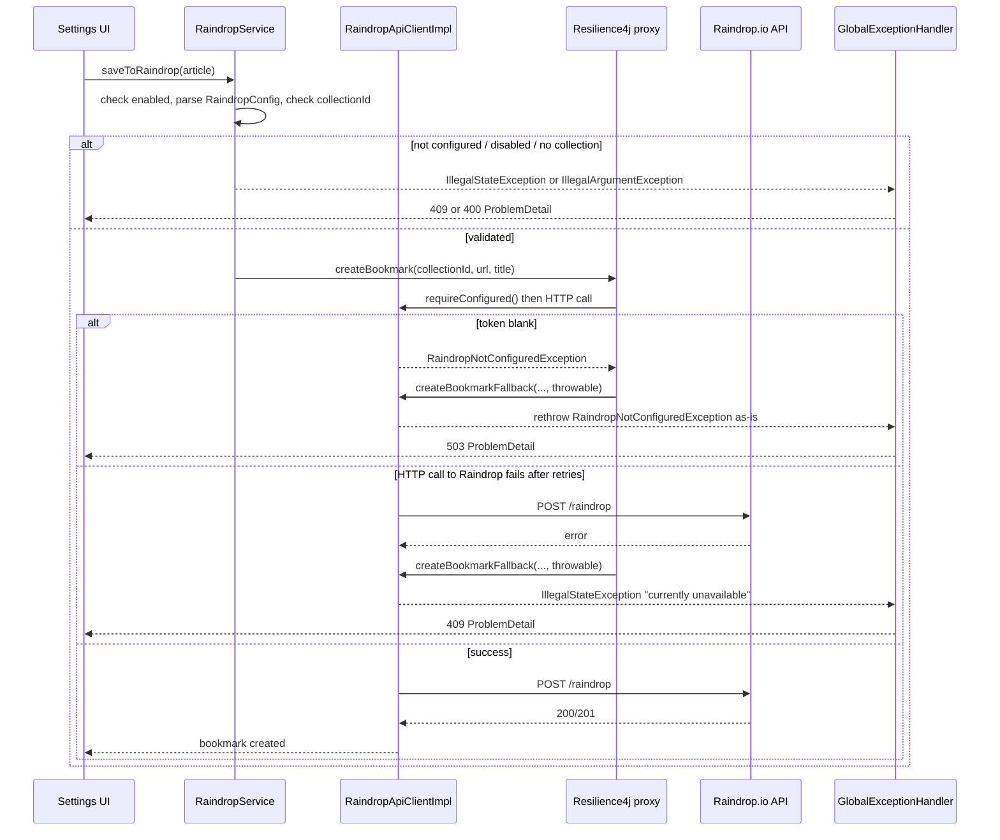

# Raindrop.io Integration

Raindrop.io is a bookmarking service. myfeeder lets a user push a saved `Article` into a chosen Raindrop collection via `POST /api/articles/{id}/raindrop`. This is the only outbound third-party integration currently implemented (Dropbox/Google Drive export is backlog-only — see `docs/backlog.md` and the Quickstart backlog).

## Why the code is split into `RaindropService` + `RaindropApiClientImpl`

This split (commit `2e33949`, "move Raindrop resilience annotations to the API client") exists specifically so that **business validation runs outside the circuit breaker** and only the real HTTP call is wrapped:

- **`RaindropService`** (`org.bartram.myfeeder.integration.RaindropService`, the business-rule layer despite living in `integration/`) looks up the `IntegrationConfig` row for `IntegrationType.RAINDROP`, checks `enabled`, deserializes `RaindropConfig` (which holds the selected `collectionId`), and throws `IllegalStateException` (not configured/disabled, →409 via `GlobalExceptionHandler.handleIllegalState`) or `IllegalArgumentException` (no collection picked, →400) *before* ever calling the API client. It also exposes `listCollections()`, cached via `@Cacheable("raindrop-collections")` (backed by Redis), so the Settings UI's collection picker doesn't hit Raindrop's API on every render.
- **`RaindropApiClientImpl`** (implements `RaindropApiClient`) owns the actual `RestClient` calls (`listCollections`, `createBookmark`) and carries the `@CircuitBreaker(name = "raindrop")` + `@Retry(name = "raindrop")` annotations. This is a **separate Spring bean** deliberately: Resilience4j's annotations are AOP-proxy-based, so if `RaindropService` called an annotated method on *itself* (self-invocation), the proxy — and the resilience behavior — would be bypassed. Putting the annotated methods on a distinct bean that `RaindropService` calls through avoids that trap.

**Convention for future external integrations:** follow this same pattern — `@CircuitBreaker`/`@Retry` on the API-client bean, not the service, with business-rule checks happening in the service before the client call.


```mermaid
sequenceDiagram
    participant UI as Settings UI
    participant Svc as RaindropService
    participant Client as RaindropApiClientImpl
    participant CB as Resilience4j proxy
    participant API as Raindrop.io API
    participant Handler as GlobalExceptionHandler

    UI->>Svc: saveToRaindrop(article)
    Svc->>Svc: check enabled, parse RaindropConfig, check collectionId
    alt not configured / disabled / no collection
        Svc-->>Handler: IllegalStateException or IllegalArgumentException
        Handler-->>UI: 409 or 400 ProblemDetail
    else validated
        Svc->>CB: createBookmark(collectionId, url, title)
        CB->>Client: requireConfigured() then HTTP call
        alt token blank
            Client-->>CB: RaindropNotConfiguredException
            CB->>Client: createBookmarkFallback(..., throwable)
            Client-->>Handler: rethrow RaindropNotConfiguredException as-is
            Handler-->>UI: 503 ProblemDetail
        else HTTP call to Raindrop fails after retries
            Client->>API: POST /raindrop
            API-->>Client: error
            CB->>Client: createBookmarkFallback(..., throwable)
            Client-->>Handler: IllegalStateException "currently unavailable"
            Handler-->>UI: 409 ProblemDetail
        else success
            Client->>API: POST /raindrop
            API-->>Client: 200/201
            Client-->>UI: bookmark created
        end
    end
```
*Control flow for `POST /api/articles/{id}/raindrop`: business validation happens before the circuit breaker, and the fallback method special-cases `RaindropNotConfiguredException` so it reaches `GlobalExceptionHandler` unmodified.*

## The fallback rethrow trap (and why it matters)

Resilience4j's `@CircuitBreaker` fallback method wraps *any* throwable reaching it into a generic 5xx by default. `RaindropApiClientImpl`'s fallback methods (`listCollectionsFallback`, `createBookmarkFallback`) explicitly `instanceof`-check for `RaindropNotConfiguredException` and rethrow it as-is (documented at the call site, commit `86d7008`) — because that exception must reach `GlobalExceptionHandler` and become a 503 (`handleRaindropNotConfigured`), not get papered over as a 409 "circuit breaker opened" error. Everything else gets wrapped as `IllegalStateException("Raindrop.io is currently unavailable", throwable)` → 409 (`handleIllegalState`).

For this rethrow to actually take effect, `RaindropNotConfiguredException` is also listed under `ignore-exceptions` for **both** the circuit breaker and retry instances in `application.yaml` — otherwise a simply-unconfigured token would count as a "failure," open the breaker, and burn retry attempts for no reason:

```yaml
resilience4j:
  circuitbreaker:
    instances:
      raindrop:
        failure-rate-threshold: 50
        wait-duration-in-open-state: 30s
        permitted-number-of-calls-in-half-open-state: 3
        sliding-window-type: COUNT_BASED
        sliding-window-size: 10
        minimum-number-of-calls: 5
        ignore-exceptions:
          - org.bartram.myfeeder.integration.RaindropNotConfiguredException
  retry:
    instances:
      raindrop:
        max-attempts: 3
        wait-duration: 1s
        exponential-backoff-multiplier: 2
        ignore-exceptions:
          - org.bartram.myfeeder.integration.RaindropNotConfiguredException
```

## Outbound transport: pinned to Reactor Netty

`RaindropApiClientImpl` builds its `RestClient` from the auto-configured `RestClient.Builder`, baseUrl'd to `myfeeder.raindrop.api-base-url`. As of the Spring Boot 4.0.8 / Spring AI 2.0.1 bump, `reactor-netty-http` is declared as an **explicit** `build.gradle.kts` dependency, because Spring AI no longer pulls it in transitively the way an earlier milestone did. Without that explicit dependency, Boot's auto-configuration would silently fall back to the JDK `HttpClient` transport for every outbound `RestClient` call — including Raindrop's `listCollections`/`createBookmark` calls, not just feed fetches — a behavior change easy to miss since both transports satisfy the same interface. Connect/read timeouts for this client come from the global `spring.http.clients.connect-timeout` / `read-timeout` keys (5s/30s), not a Raindrop-specific override. See [Architecture Overview](../architecture/overview.md)'s platform notes for the full rationale and the regression test (`HttpClientConfigurationTest.outboundTransportIsReactorNetty()`) that guards this.

## Configuration and secret handling

The Raindrop **API token is a config property, not a DB value**: `myfeeder.raindrop.api-token` binds to env var `MYFEEDER_RAINDROP_API_TOKEN` (see `MyfeederProperties.Raindrop`). `V4__strip_raindrop_api_token.sql` (see [Domain Concepts](../domain/concepts.md)) removed an earlier design where the token lived inside `integration_config.config`'s JSON blob — don't reintroduce that. `RaindropApiClientImpl.requireConfigured()` throws `RaindropNotConfiguredException` whenever the token is blank, which is the trigger for the whole ignore-exceptions/rethrow chain above. `GET /api/integrations/raindrop/status` exposes a simple `{"configured": true/false}` check (based on whether the token is blank) so the Settings UI can show integration status without triggering a real API call.

In deployment, the token flows: local env var → `deploy.sh` (`MYFEEDER_RAINDROP_API_TOKEN`, optional — a warning is printed and `RAINDROP_TOKEN` defaults to empty if unset, integration is simply disabled) → Helm `--set secrets.raindropApiToken` → chart `Secret` (`myfeeder-raindrop-api-token` key in `helm/myfeeder/templates/app-secret.yaml`) → mounted as an env var in `app-deployment.yaml`. See [Operations Runbook](../operations/runbook.md).

## Testing this integration

`RaindropServiceTest` covers the business-rule layer with Mockito (`@InjectMocks`/`@Mock`): not-configured/disabled/no-collection-selected error paths, successful delegation to `RaindropApiClient.createBookmark`, and the case-insensitive collection sort in `listCollections()`.

`RaindropApiClientImplTest` covers the HTTP layer directly: it instantiates `RaindropApiClientImpl` as a plain object (not through a Spring context), binds `MockRestServiceServer` to the `RestClient.Builder`, and asserts the request URI/method/headers/body for both `listCollections` and `createBookmark`, plus that a blank token makes `requireConfigured()` throw `RaindropNotConfiguredException` before any HTTP call is attempted. Because the class under test isn't wrapped in a Resilience4j AOP proxy in this test, `listCollectionsFallback`/`createBookmarkFallback` themselves are **not exercised** here — the instanceof-rethrow logic inside the fallback methods currently has no dedicated automated test and is only exhibited through the real Spring-managed bean at runtime. Keep this in mind when changing the fallback logic or the `ignore-exceptions` config: a passing `RaindropApiClientImplTest` does not confirm the circuit-breaker fallback path still rethrows correctly. See [Testing Guide](../testing/guide.md).
