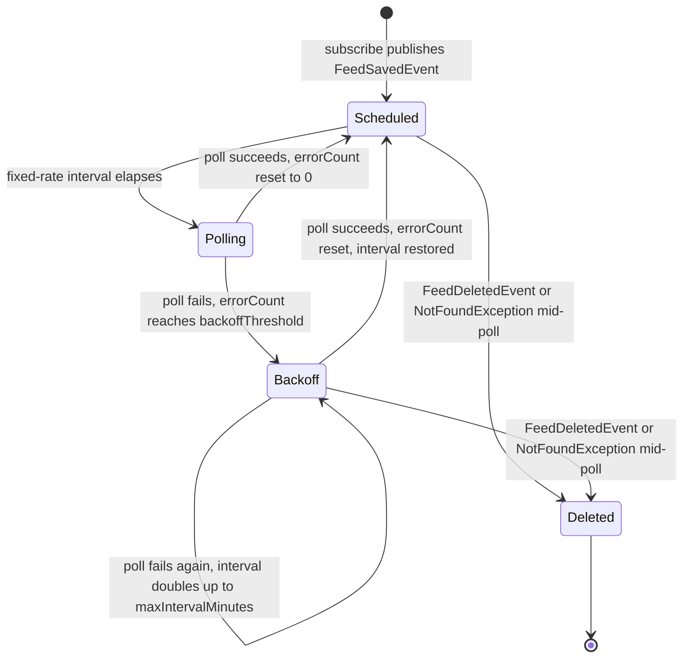

# Feed Lifecycle Workflow

This is the core business process of myfeeder: get new articles from subscribed feeds into the database reliably, without hammering slow or broken feeds.

## 1. Subscribe

`FeedService.subscribe(feedUrl, folderId)`:
1. Calls `FeedFetcher.fetch(url)` — an **unconditional** GET (see [Architecture Overview](../architecture/overview.md) on `FeedFetcher` being the single fetch path). Before issuing the request, `FeedFetcher` delegates to `FeedUrlValidator.validate(url)`, an SSRF guard that rejects anything but `http`/`https` schemes and rejects any hostname that resolves to a non-public address — loopback, link-local, RFC 1918 site-local, any-local (`0.0.0.0`), or multicast — plus carrier-grade NAT (`100.64.0.0/10`), IPv6 unique-local (`fc00::/7`), and the limited broadcast address; a failure throws `IllegalArgumentException`, mapped by `GlobalExceptionHandler` to HTTP 400. This keeps a caller-supplied feed URL from steering the server at internal targets (databases, in-cluster services, cloud metadata endpoints). The validator documents accepted limitations for its single-user LAN deployment: it does not pin the connection to the validated IP (so DNS rebinding between validation and the actual connect is possible), and it does not re-validate redirects per hop.
2. Once validated, `FeedFetcher` performs the GET and bounds the response body to `DEFAULT_MAX_FEED_BYTES` (10 MiB) by reading at most that many bytes plus one; exceeding the cap throws `FeedFetchException`, mapped to HTTP 422. This bounds heap use so a huge or unbounded/streaming response can't OOM the process.
3. Parses the response with `FeedParser` (ROME for RSS/Atom, Jackson for JSON Feed) into a `ParsedFeed`. `FeedParser.parse` throws `FeedParseException` (→422) if the result has no title and no articles — this guards against "200 OK with garbage" responses that would otherwise violate the `feed.title NOT NULL` constraint.
4. Saves a new `Feed` row with `pollIntervalMinutes` from `myfeeder.polling.default-interval-minutes`.
5. Publishes `FeedSavedEvent(saved)` via `ApplicationEventPublisher` — this is what actually schedules polling (see step 2).

Because there is a single `FeedFetcher.fetch` entry point, both the subscribe path above and the recurring poll path (step 3 below) inherit the same URL validation and body-size cap — there is no second, unguarded way to reach a feed's origin server.

`OpmlImportService.importOpml` follows the same "create feed → publish `FeedSavedEvent`" pattern per new feed when bulk-importing an OPML file (existing feeds by URL are updated in place, not re-published).

## 2. Event-driven scheduling

**Never call `FeedPollingScheduler.registerFeed`/`cancelFeed` directly from new feed-mutating code.** Publish `FeedSavedEvent` or `FeedDeletedEvent` instead — this was a deliberate refactor (commit `9583ac2`) to decouple the scheduler from services.

`FeedPollingScheduler` listens with:
```java
@TransactionalEventListener(phase = TransactionPhase.AFTER_COMMIT, fallbackExecution = true)
```
on both `onFeedSaved`/`onFeedDeleted`. `AFTER_COMMIT` ensures the scheduler only reacts once the feed row is actually durable; `fallbackExecution = true` makes it still fire in non-transactional contexts (e.g. tests without a transaction). On app startup, `onStartup()` (`@EventListener(ApplicationReadyEvent.class)`) registers every existing feed.

`registerFeed` computes an **effective interval** (see backoff below) and schedules `pollAndAdjust` via `TaskScheduler.scheduleAtFixedRate`.

## 3. Poll + dedup

`FeedPollingService.pollFeed(feedId)`:
1. Conditional fetch via `FeedFetcher.fetch(url, etag, lastModifiedHeader)` — sends `If-None-Match`/`If-Modified-Since`. A 304 short-circuits (just updates `lastPolledAt`). This call goes through the same validated, size-bounded `FeedFetcher` path used at subscribe time (step 1).
2. On 200, re-parses and **dedups articles by `(feed_id, guid)`** using `articleRepository.existsByFeedIdAndGuid` before inserting — this is the mechanism that prevents duplicate articles across polls.
3. On success: `errorCount` resets to 0, `lastError` cleared, `lastSuccessfulPollAt` updated.
4. On any exception: `errorCount` increments and `lastError` is recorded, but the exception is swallowed (logged, not rethrown) — a single bad poll never crashes the scheduler thread.

## 4. Backoff — the interval self-adjusts after every poll

This is the trickiest part of the codebase and had two bugfix commits (`933950e`, `c95abec`) before landing correctly. After `pollFeed` returns (success or failure), `FeedPollingScheduler.pollAndAdjust` **re-reads the feed's current error state from the DB** and recomputes the effective interval via `computeEffectiveInterval`:

- If `errorCount >= backoffThreshold` (default 5), the interval is `pollIntervalMinutes * 2^(errorCount / backoffThreshold)`, capped at `maxIntervalMinutes` (default 1440 = 24h). The exponent itself is clamped to 30 and the multiplier uses `long` arithmetic so repeated failures can never overflow the doubling into a negative `Duration` (which would make `scheduleAtFixedRate` throw and crash startup for a persistently failing feed).
- Otherwise, the interval is just the feed's configured `pollIntervalMinutes`.

If the desired interval differs from the currently scheduled one, the task is cancelled and replaced with a new `scheduleAtFixedRate` starting one full interval from now. This means backoff **engages progressively** as a feed keeps failing, and **clears immediately** once it succeeds again — without ever needing an external cron sweep. The interval re-evaluation itself is wrapped in a try/catch that logs a warning and keeps the current schedule on failure, so a transient DB blip during re-evaluation can't silently unschedule a feed (fixed by `c95abec`).

There's an inherent, accepted race: a concurrent external `registerFeed`/`cancelFeed` (e.g. the user edits the feed at the same moment a poll completes) could in theory conflict with this self-replacement. The code comment in `FeedPollingScheduler` explicitly accepts this as fine for a single-user deployment.


*A subscribed feed's polling state: normal-interval scheduling, escalating backoff after repeated failures, and cancellation on deletion.*

## 5. Deletion

`FeedService.delete(id)` deletes the row (cascades to articles via FK `ON DELETE CASCADE` — see [Domain Concepts](../domain/concepts.md)) and publishes `FeedDeletedEvent(id)`, which the scheduler uses to cancel the scheduled task. `FeedPollingScheduler.pollAndAdjust` also self-cancels if `pollFeed` throws `NotFoundException` (feed deleted mid-flight).

## 6. Retention (separate, unrelated cron)

`RetentionService.cleanupOldContent()` is a plain `@Scheduled(cron = myfeeder.retention.cleanup-cron)` job (default daily at 03:00) that clears `content`/`summary` text on articles older than `full-content-days` (default 30) via `articleRepository.clearContentOlderThan`. This is independent of the polling/backoff mechanism above — it only trims stored content, it does not delete or unschedule anything.

## What to watch out for when changing this

- Any new code path that creates/updates/deletes a `Feed` must publish the corresponding event — don't add a second way to register/cancel scheduled polling.
- Any new code path that needs to fetch a feed URL should go through `FeedFetcher`, not a raw HTTP client — that's the only place the SSRF guard and body-size cap are applied.
- `computeEffectiveInterval` is duplicated conceptually only in `FeedPollingScheduler`; if you change backoff math, there's exactly one place to change it.
- Tests: `FeedPollingSchedulerTest`, `FeedPollingServiceTest`, `FeedServiceTest`, `FeedUrlValidatorTest`, `OpmlImportServiceTest` — see [Testing Guide](../testing/guide.md).
