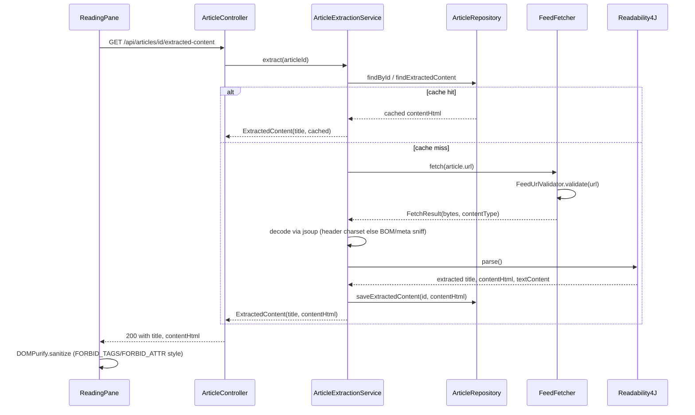

# Feed Lifecycle Workflow

This is the core business process of myfeeder: get new articles from subscribed feeds into the database reliably, without hammering slow or broken feeds. It also covers a second, on-demand flow — reader-view content extraction — that shares the same fetch path but runs outside the poll/backoff cycle.

## 1. Subscribe

`FeedService.subscribe(feedUrl, folderId)`:
1. Calls `FeedFetcher.fetch(url)` — an **unconditional** GET (see [Architecture Overview](../architecture/overview.md) on `FeedFetcher` being the single fetch path). Before issuing any request, `FeedFetcher.fetch` calls `FeedUrlValidator.validate(url)` to guard against SSRF: the URL must use `http`/`https`, and every address the host resolves to is rejected if it is loopback, link-local, RFC1918 site-local, any-local, multicast, a `fc00::/7` unique-local IPv6 address, or in the `100.64.0.0/10` carrier-grade-NAT range. A failed check throws `IllegalArgumentException` (→400) before any network call is made. This validation runs on **every** `FeedFetcher.fetch` call, so it applies identically at subscribe time, at poll time, and to the reader-view fetch (section 7).
2. Parses the response with `FeedParser` (ROME for RSS/Atom, Jackson for JSON Feed) into a `ParsedFeed`. `FeedParser.parse` throws `FeedParseException` (→422) if the result has no title and no articles — this guards against "200 OK with garbage" responses that would otherwise violate the `feed.title NOT NULL` constraint.
3. Saves a new `Feed` row with `pollIntervalMinutes` from `myfeeder.polling.default-interval-minutes`.
4. Publishes `FeedSavedEvent(saved)` via `ApplicationEventPublisher` — this is what actually schedules polling (see step 2).

`OpmlImportService.importOpml` follows the same "create feed → publish `FeedSavedEvent`" pattern per new feed when bulk-importing an OPML file (existing feeds by URL are updated in place, not re-published).

**Accepted limitations of the SSRF guard** (documented on `FeedUrlValidator`'s class javadoc, accepted for the single-user LAN deployment):
- **DNS rebinding / TOCTOU**: the validator resolves the host and checks the IP, but the underlying `RestClient` resolves again when it actually connects. A host whose DNS answer changes between those two lookups can pass validation yet connect to a private address. Closing this gap would require pinning the connection to the already-validated IP (a custom resolver/socket factory), which is not implemented.
- **Redirects are not re-validated per hop** — a permitted URL may redirect to a blocked one; the validator only checks the URL it is given.

## 2. Event-driven scheduling

**Never call `FeedPollingScheduler.registerFeed`/`cancelFeed` directly from new feed-mutating code.** Publish `FeedSavedEvent` or `FeedDeletedEvent` instead — this was a deliberate refactor (commit `9583ac2`) to decouple the scheduler from services.

`FeedPollingScheduler` listens with:
```java
@TransactionalEventListener(phase = TransactionPhase.AFTER_COMMIT, fallbackExecution = true)
```
on both `onFeedSaved`/`onFeedDeleted`. `AFTER_COMMIT` ensures the scheduler only reacts once the feed row is actually durable; `fallbackExecution = true` makes it still fire in non-transactional contexts (e.g. tests without a transaction). On app startup, `onStartup()` (`@EventListener(ApplicationReadyEvent.class)`) registers every existing feed.

`registerFeed` computes an **effective interval** (see backoff below) and schedules `pollAndAdjust` via `TaskScheduler.scheduleAtFixedRate`.

## 3. Poll + dedup

`FeedPollingService.pollFeed(feedId)`:
1. Conditional fetch via `FeedFetcher.fetch(url, etag, lastModifiedHeader)` — sends `If-None-Match`/`If-Modified-Since`. As with the unconditional subscribe-time fetch, this call runs `FeedUrlValidator.validate(url)` first, so a feed whose URL now resolves to a private/blocked address (e.g. after a DNS change) fails the poll rather than being fetched. A 304 short-circuits (just updates `lastPolledAt`).
2. On 200, re-parses and **dedups articles by `(feed_id, guid)`** using `articleRepository.existsByFeedIdAndGuid` before inserting — this is the mechanism that prevents duplicate articles across polls.
3. On success: `errorCount` resets to 0, `lastError` cleared, `lastSuccessfulPollAt` updated.
4. On any exception (including a validator rejection): `errorCount` increments and `lastError` is recorded, but the exception is swallowed (logged, not rethrown) — a single bad poll never crashes the scheduler thread.

## 4. Backoff — the interval self-adjusts after every poll

This is the trickiest part of the codebase and had two bugfix commits (`933950e`, `c95abec`) before landing correctly. After `pollFeed` returns (success or failure), `FeedPollingScheduler.pollAndAdjust` **re-reads the feed's current error state from the DB** and recomputes the effective interval via `computeEffectiveInterval`:

- If `errorCount >= backoffThreshold` (default 5), the interval is `pollIntervalMinutes * 2^(errorCount / backoffThreshold)`, capped at `maxIntervalMinutes` (default 1440 = 24h).
- Otherwise, the interval is just the feed's configured `pollIntervalMinutes`.

If the desired interval differs from the currently scheduled one, the task is cancelled and replaced with a new `scheduleAtFixedRate` starting one full interval from now. This means backoff **engages progressively** as a feed keeps failing, and **clears immediately** once it succeeds again — without ever needing an external cron sweep. The interval re-evaluation itself is wrapped in a try/catch that logs a warning and keeps the current schedule on failure, so a transient DB blip during re-evaluation can't silently unschedule a feed (fixed by `c95abec`).

There's an inherent, accepted race: a concurrent external `registerFeed`/`cancelFeed` (e.g. the user edits the feed at the same moment a poll completes) could in theory conflict with this self-replacement. The code comment in `FeedPollingScheduler` explicitly accepts this as fine for a single-user deployment.

The diagram below shows one full poll cycle, including how the SSRF guard and error/backoff bookkeeping interact:

<!-- openwiki: mermaid parse failed and this diagram was converted to a text fence so it does not break rendering. Fix the diagram source and restore the mermaid fence. Parser error: Heuristic: an unescaped angle bracket inside a label breaks rendering; rephrase the label. -->
```text
flowchart TD
    Start["Scheduled tick: pollAndAdjust(feedId)"] --> Fetch["FeedFetcher.fetch(url, etag, lastModified)"]
    Fetch --> Validate{"FeedUrlValidator.validate(url) passes?"}
    Validate -- no --> Fail["Catch exception: errorCount++, lastError set"]
    Validate -- yes --> Http{"HTTP response"}
    Http -- "304 Not Modified" --> UpdatePolled["Update lastPolledAt only"]
    Http -- "200 OK" --> Parse["Re-parse feed, dedup by feed_id+guid"]
    Http -- "4xx/5xx or size cap exceeded" --> Fail
    Parse --> Success["errorCount = 0, lastError cleared, lastSuccessfulPollAt updated"]
    UpdatePolled --> Recompute["Re-read errorCount from DB, computeEffectiveInterval"]
    Success --> Recompute
    Fail --> Recompute
    Recompute --> Threshold{"errorCount >= backoffThreshold?"}
    Threshold -- yes --> Backoff["interval = pollIntervalMinutes * 2^(errorCount/backoffThreshold), capped at maxIntervalMinutes"]
    Threshold -- no --> Normal["interval = pollIntervalMinutes"]
    Backoff --> Reschedule{"Desired interval differs from scheduled?"}
    Normal --> Reschedule
    Reschedule -- yes --> Replace["Cancel task, scheduleAtFixedRate again from now + interval"]
    Reschedule -- no --> Done["Keep existing schedule"]
```
*Poll cycle: SSRF validation gates every fetch, and the effective interval is recomputed from the persisted error state after every poll, success or failure.*

## 5. Deletion

`FeedService.delete(id)` deletes the row (cascades to articles via FK `ON DELETE CASCADE` — see [Domain Concepts](../domain/concepts.md)) and publishes `FeedDeletedEvent(id)`, which the scheduler uses to cancel the scheduled task. `FeedPollingScheduler.pollAndAdjust` also self-cancels if `pollFeed` throws `NotFoundException` (feed deleted mid-flight).

## 6. Retention (separate, unrelated cron)

`RetentionService.cleanupOldContent()` is a plain `@Scheduled(cron = myfeeder.retention.cleanup-cron)` job (default daily at 03:00) that clears `content`/`summary` text (and the cached `extracted_content`, see section 7) on articles older than `full-content-days` (default 30) via `articleRepository.clearContentOlderThan`. This is independent of the polling/backoff mechanism above — it only trims stored content, it does not delete or unschedule anything. A later reader-view request for a purged article simply re-fetches and re-extracts, repopulating the cache.

## 7. Reader view / content-extraction flow (on-demand, not scheduled)

Unlike sections 1–6, this flow is **not** part of the recurring poll/backoff cycle: it runs once per user request, triggered from the frontend `ReadingPane` either automatically (when the selected article has no feed-supplied `content`/`summary`) or manually via the "📖 Reader View" toolbar toggle (which flips back to "📖 Feed View").

1. The frontend calls `GET /api/articles/{id}/extracted-content` (`articlesApi.getExtractedContent`, wrapped by the `useExtractedArticle` React Query hook, `staleTime: Infinity` and `retry: false` since a cached server-side result never goes stale and extraction failures are deterministic).
2. `ArticleController.extractedContent` delegates to `ArticleExtractionService.extract(articleId)`.
3. `ArticleExtractionService.extract`:
   - Looks up the `Article`; throws `NotFoundException` (→404) if it doesn't exist, or `IllegalArgumentException` (→400) if it has no `url`.
   - Checks the `extracted_content` cache via `articleRepository.findExtractedContent(id)`. On a cache hit, returns immediately without any network call.
   - On a cache miss, fetches `article.url` via `FeedFetcher.fetch(url)` — reusing the same SSRF guard (`FeedUrlValidator`), response size cap (`DEFAULT_MAX_FEED_BYTES`), and configured User-Agent as feed polling. A fetch failure surfaces as `FeedFetchException` (→422).
   - Decodes the response bytes with jsoup: the `Content-Type` header's charset is used when declared, otherwise jsoup falls back to BOM/meta-tag sniffing (`Jsoup.parse(InputStream, charsetName, baseUri)` with a `null` charset name).
   - Runs `Readability4J(url, html).parse()` to extract the readable article body. If parsing throws, or the result has no content/text, `FeedParseException` (→422) is thrown ("no readable content found").
   - Persists the extracted HTML into the `article.extracted_content` column (migration `V5__article_extracted_content.sql`) via `articleRepository.saveExtractedContent`, so subsequent requests for the same article hit the cache.
   - Returns an `ExtractedContent { title, contentHtml }` record — `title` falls back to the article's feed-supplied title if Readability4J found no title.
4. All four failure modes (`NotFoundException`, `IllegalArgumentException`, `FeedFetchException`, `FeedParseException`) are mapped to their HTTP statuses by the shared `GlobalExceptionHandler` (404, 400, 422, 422 respectively) — the same handler used by the subscribe/poll paths.
5. On the client, `ReadingPane` sanitizes the returned `contentHtml` with `DOMPurify.sanitize(html, { FORBID_TAGS: ['style'], FORBID_ATTR: ['style'] })` before rendering with `dangerouslySetInnerHTML`, stripping publisher inline styling (e.g. dark backgrounds) so the app's own theme applies. This is a stricter sanitization pass than the default one used for ordinary feed-supplied `content`/`summary` HTML.


```mermaid
sequenceDiagram
    participant RP as ReadingPane
    participant AC as ArticleController
    participant AES as ArticleExtractionService
    participant Repo as ArticleRepository
    participant FF as FeedFetcher
    participant RD as Readability4J

    RP->>AC: GET /api/articles/id/extracted-content
    AC->>AES: extract(articleId)
    AES->>Repo: findById / findExtractedContent
    alt cache hit
        Repo-->>AES: cached contentHtml
        AES-->>AC: ExtractedContent(title, cached)
    else cache miss
        AES->>FF: fetch(article.url)
        FF->>FF: FeedUrlValidator.validate(url)
        FF-->>AES: FetchResult(bytes, contentType)
        AES->>AES: decode via jsoup (header charset else BOM/meta sniff)
        AES->>RD: parse()
        RD-->>AES: extracted title, contentHtml, textContent
        AES->>Repo: saveExtractedContent(id, contentHtml)
        AES-->>AC: ExtractedContent(title, contentHtml)
    end
    AC-->>RP: 200 with title, contentHtml
    RP->>RP: DOMPurify.sanitize (FORBID_TAGS/FORBID_ATTR style)
```
*Reader-view request: a cache hit skips the network fetch and extraction entirely; a miss reuses the poll path's SSRF guard, size cap, and User-Agent before extracting and caching.*

## What to watch out for when changing this

- Any new code path that creates/updates/deletes a `Feed` must publish the corresponding event — don't add a second way to register/cancel scheduled polling.
- `computeEffectiveInterval` is duplicated conceptually only in `FeedPollingScheduler`; if you change backoff math, there's exactly one place to change it.
- Any new code path that fetches a caller-supplied or stored URL should go through `FeedFetcher.fetch` (or otherwise call `FeedUrlValidator.validate` first) to keep the SSRF guard applied uniformly — don't add a second HTTP client that bypasses it.
- The reader-view cache (`article.extracted_content`) has no separate TTL/expiry job; it lives until `RetentionService` clears it alongside `content`/`summary`, or the article row is deleted.
- Tests: `FeedPollingSchedulerTest`, `FeedPollingServiceTest`, `FeedServiceTest`, `OpmlImportServiceTest`, `FeedUrlValidatorTest`, `FeedFetcherTest`, `ArticleExtractionServiceTest`, `ArticleControllerTest` — see [Testing Guide](../testing/guide.md).
