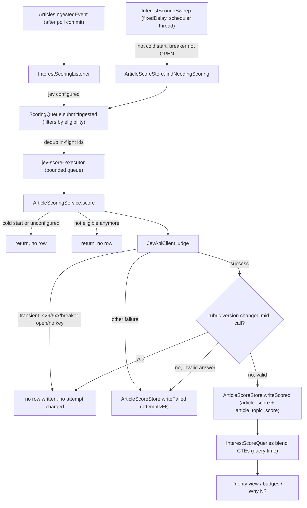

# Interest Ranking & Engagement Learning Workflow

This is the second major business process in myfeeder (alongside [feed polling](feed-lifecycle.md)): articles are judged against a user-defined rubric (a free-text profile plus up to 25 weighted topics), the judgments are blended into a 0–100 interest score at read time, and that score drives the Priority view. Three further sub-flows refine it without ever re-scoring: thumbs feedback, passive engagement capture, and gap discovery. The full Jev client/resilience plumbing (circuit breaker, retry, executor wiring) is documented separately in [Jev (TypeSafe) Scoring Integration](../integrations/jev.md); this page covers only what the scoring pipeline does with that client.

## Cold start and the rubric-version discard rule

Two invariants gate (almost) everything in this workflow:

- **Cold-start predicate** — `InterestService.isColdStart()` is the single gate: true only when the profile text is blank after trim **and** there are zero topics. `ArticleScoringService.score`, `InterestScoringSweep.sweep`, and `InterestRescoreService.rescore` all call this one method; none reimplements the check.
- **Rubric-version discard rule** — `ArticleScoringService.score` snapshots the profile version and every topic's version *before* calling `JevApiClient.judge`. After the call returns, it re-reads both; if the profile version or any topic's version-set changed mid-call, it stores nothing and records no attempt, leaving the article for the sweep to re-pick against the current rubric. A topic's name or weight edit never bumps its version (only an edited description does), so those edits do not trigger a discard.

## Ingest → score → rank pipeline

*New articles enter scoring on ingest or via the periodic sweep; Jev is called at most once per attempt, and only a successfully stored, still-current-rubric score ever reaches the ranking SQL.*

### Eligibility window and attempts

`ArticleScoreStore.ELIGIBLE` is the one predicate every query in this area is built from: `read = false AND COALESCE(published_at, fetched_at) > now − window-days` (14 days by default). An article `NEEDS_SCORING` when it has no `article_score` row, or a `FAILED` row with fewer than `MAX_ATTEMPTS` (3) attempts. Transient failures — 429, 5xx, connection errors, an open circuit breaker, or a missing key (`ScoringFailure.isTransient`) — write **no row** and burn **no attempt**, so a rate-limited Jev never exhausts an article's retry budget; a 429 can be retried indefinitely by later sweeps. Other failures (invalid answer, write failure) do count, bounding an article at 3 billed attempts before it is permanently `FAILED`. A `SKIPPED` row (no GUID, no judgeable text) is terminal and never retried.

### Queue and sweep mechanics

- **`ScoringQueue`** deduplicates by article id (`inFlight` set): an id already queued or running is never submitted twice, and it is released whether scoring succeeds, throws, or the executor rejects it (`TaskRejectedException`), so a full queue never strands an id — the next sweep picks it up again.
- The Jev call itself runs on the dedicated `interestScoringExecutor` bean (core = max = `myfeeder.interest.concurrency`, default 1; bounded queue capacity 1000), never inline on the scheduler thread or the polling thread.
- **`InterestScoringSweep`** is the only drain loop: it runs on `fixedDelay` (`myfeeder.interest.sweep-delay`, default `PT2M`) after an initial delay (`sweep-initial-delay`, `PT1M`), skips while Jev is unconfigured, cold start holds, or the `jev` breaker is OPEN/FORCED_OPEN (HALF_OPEN still runs, so the breaker's automatic OPEN→HALF_OPEN transition resumes scoring on its own), and otherwise enqueues `min(free queue room, sweep-batch-size)` (default 50) eligible ids, newest first.
- Freshly ingested articles also enter via `InterestScoringListener`, an `AFTER_COMMIT` transactional listener on `ArticlesIngestedEvent` that calls `ScoringQueue.submitIngested` — filtered through the same eligibility predicate, uncapped by the sweep's batch size.
- Throttling levers (batch size, sweep delay, concurrency) and the emergency env-var override are operational concerns covered in the [runbook](../operations/runbook.md); the resilience layer itself (retry/breaker tuning) is covered in [Jev Integration](../integrations/jev.md).

## Blended / learned Priority ranking

`InterestScoreQueries` is the single source of truth for the Priority sort, the interest badge, and the "Why N?" breakdown — every query is built from the same CTEs, so the three can never disagree. It only reads stored Jev outputs; it never writes a row and never calls Jev.

- **Base blend**: each SCORED article's raw score is a weighted combination of the profile score and every judged topic's `weight x hinge` contribution (hinge being the noul's distance above 0.5), produced once by Jev and stored write-once.
- **Learned adjustment**: at query time, the `learned`/`engaged`/`eng_learned`/`eff`/`eff2` CTEs in `InterestScoreQueries.LEARNED_CTE` derive a per-topic adjustment from two independent signals — thumbs votes (`article_feedback`) and engagement (`article_engagement`) — and add it to each topic's base weight before computing the blend. Because this happens in SQL at read time, changing a blend constant (learn rate, caps, tier thresholds) never requires a re-score: the next read reflects it immediately.
- **`LearnedLimit.of(weight, learnedCap, engagementCap)`** reports which rule actually bound a topic's effective weight, in this precedence: `LEARNED_CAP` (uncapped thumbs points reach the learned cap) → `SIGN_CLAMP` (base + learned would cross zero, held at 0) → `WEIGHT_RANGE` (|base + learned| beyond ±50) → `ENGAGEMENT_CAP` (only when no earlier bound holds and the uncapped engagement points reach the engagement cap; a cap of 0 disables this check entirely) → `NONE`. `LearnedLimit.engagementAtCap` is the one rule behind both the `ENGAGEMENT_CAP` report and the `TopicLearned.engagementAtCap` flag returned by `GET /api/interest/topics/learned`, so a topic can show `engagementAtCap = true` while a different, binding limit (e.g. `SIGN_CLAMP`) is reported.
- **Tier thresholds**: `myfeeder.interest.blend.tiers.high|neutral` (served as `tiers` on `GET /api/interest/status`) drive the Priority view's high/neutral/low badge coloring; the frontend reads them through `useInterestTiers` → `TierContext`, falling back to a hardcoded default until status loads.

## Thumbs feedback

`PUT /api/articles/{id}/feedback` (`{vote: 1|-1, topicIds?}`) and `DELETE /api/articles/{id}/feedback` write or remove exactly one `article_feedback` row (plus `article_feedback_topic` picks when the vote is narrowed to specific topics) through `ArticleFeedbackService`. Validation (vote must be ±1, `topicIds` must be non-empty when present and name only topics the article matched) runs before any write, with fixed-text 400s. The response, `{article, scored, effects[]}`, reports each matched topic's effective weight before and after the write, read inside the same transaction.

A vote **never calls Jev and never writes a topic's base weight** — it only adds a row that the `learned` CTE folds in at the next read. In the blend math, the thumbs term is `learn-rate × sum(vote × hinge)` per topic, capped at ±learned-cap, then sign-clamped and range-clamped to ±50 together with the engagement term.

## Engagement capture and learning

Engagement is captured as a distinct, best-effort sub-flow, independent of scoring and feedback:

- `ArticleEngagementStore.recordQuietly` writes one sticky `article_engagement(article_id, kind)` row (`ON CONFLICT DO NOTHING`), for `OPEN_ORIGINAL`, `STAR`, `BOARD`, or `RAINDROP`. Each call site — `ArticleService.updateState` (unstarred→starred only), `BoardService.addArticle`, and `RaindropService` right after a successful bookmark — runs **outside any transaction**, so a failed insert (logged at WARN with only the kind, id, and exception class) can never abort the user's save. `OPEN_ORIGINAL` is recorded via a separate bodyless `PUT /api/articles/{id}/engagement/open` fired after `window.open`.
- The learned CTE's `engaged` step collapses all engagement rows for an article to a single MAX strength (`OPEN_ORIGINAL` → `engagement.open-weight`, any save kind → the larger `engagement.save-weight`) before joining topics, so one article counts once even with several engagement kinds.
- **A vote on a topic replaces that topic's engagement contribution, and removing the vote restores it**: `engaged` excludes any article that has an `article_feedback` row at all, so once a user votes, that article's passive engagement signal is dropped from the learned term for every topic; deleting the vote (`DELETE /api/articles/{id}/feedback`) makes the article eligible for the engagement term again.
- `eng_learned` counts SCORED articles only, with no age or read-window restriction, and the engagement term is zero for any topic with a negative base weight. The result is capped additively at `myfeeder.interest.blend.engagement.cap` with a zero floor, so engagement can never lower a topic's weight — it is strictly an up-vote-like signal, separate from the (positive-or-negative) thumbs term.
- **Frontend reaction**: `afterEngagement`/`invalidateAfterLearnedChange` (`hooks/engagementReaction.ts`) run after every successful engagement action (open, star, board add, Raindrop save, Forget). They refetch `['article', id]` with `staleTime: 0` and invalidate `['interest', 'learned']`, `['interest', 'suggestions']`, and `['articles']` (plus other open by-id articles off the Priority route). On `/priority`, they only patch the affected row's `interestScore` in place and set a "Ranking changed" hint when the refetched score differs — **`['priority']` is never invalidated, reset, or refetched**, so the list a user is actively triaging never re-sorts out from under them mid-session. Unstar, board removal, and read toggles do not trigger this reaction.

## Gap discovery (topic suggestions)

`GET /api/interest/suggestions` is a fourth, independent sub-flow: it surfaces articles the user has engaged with but that no topic covers well, as candidate new topics — **Jev is never called** for listing, dismissing, or creating a topic from a suggestion.

- **Candidate predicate** (`TopicSuggestionStore.CANDIDATES`): an article with any engagement whose first recording (per kind) falls within the last `TopicSuggestionService.WINDOW_DAYS` (30) days; a `SCORED` row; no `article_feedback` row (no vote); no `topic_suggestion_dismissal` row; and a best noul across every topic row (either weight sign; no rows counts as 0) below `myfeeder.interest.suggestions.near-miss` (0.35). Because `article_engagement` keeps only the first `created_at` per (article, kind), repeating an engagement of the same kind never refreshes the window, but a new kind can.
- **Ordering**: badge ascending (most "surprising" misses first) — computed by a second call into `InterestScoreQueries.displayScores`, so the ranking SQL itself is untouched and never reads the dismissal table — then latest engagement newest-first, then id descending. At most `MAX_SUGGESTIONS` (10) items plus a `total` count; a candidate whose badge vanished between the two queries is silently dropped and not counted.
- **Terminal, mutually exclusive lifecycle**: `TopicSuggestionStore` is the only reader and writer of `topic_suggestion_dismissal`. `PUT /suggestions/{articleId}/dismissal` (bodyless, 204, idempotent) writes `DISMISSED`. Creating a topic with a `sourceArticleId` (`POST /api/interest/topics`) writes `TOPIC_CREATED` inside the same transaction as the topic insert, in `InterestService.createTopic`, so the two commit or roll back together; `PUT /topics/{id}` never accepts `sourceArticleId`. `TopicSuggestionStore.handle` is a single `INSERT ... ON CONFLICT (article_id) DO NOTHING`, so the first reason recorded wins, a stale article id inserts nothing and never blocks a topic save, and there is no un-dismiss — a handled article never returns, even after a later engagement.

## Routes under `/api/interest`

| Area | Routes | Notes |
|---|---|---|
| Profile | `GET`/`PUT /profile` | Free-text rubric; version bumps only when the text changes; an empty text clears it. |
| Topics | `GET`/`POST /topics`, `PUT`/`DELETE /topics/{id}` | Up to 25 topics, weight −50..+50; `POST` accepts an optional `sourceArticleId` to close a suggestion atomically with the create; name/weight edits don't bump a topic's version, only a description edit does. |
| Learned topics | `GET /topics/learned` | Base/learned/effective weight per topic plus `thumbsLearned`, `engagementLearned`, `engagementAtCap`, and the binding `LearnedLimit`. |
| Status | `GET /status` | `{configured, breakerState, coldStart, eligibleUnscored, failed, tiers}`; the frontend polls it every 15s only while `configured && !coldStart && eligibleUnscored > 0`. |
| Preview | `POST /preview` | Judges one description against one article with a single `judge()` call; persists nothing; used so a draft topic's rubric text is validated against real article text before saving. |
| Suggestions | `GET /suggestions`, `PUT /suggestions/{articleId}/dismissal` | Gap discovery, described above. |
| Rescore | `GET`/`POST /rescore` | `GET` counts the in-scope rows (eligible, SCORED-or-FAILED, SKIPPED excluded) without deleting anything; `POST` requires the JSON body `{"confirm": true}` (a bodyless/form/text POST gets 415, a missing or false `confirm` gets 400 — this blocks cross-site triggering) and deletes those score rows so the sweep re-scores them; it answers 409 when Jev is unconfigured or the rubric is in cold start. |
| Thumbs feedback | `PUT`/`DELETE /api/articles/{id}/feedback` | Covered above; lives under `/api/articles`, not `/api/interest`. |

## Calibration

The constants that drive the blend and the engagement term (open/save weight, caps, tier thresholds, near-miss threshold) are all applied at query time, so tuning them never requires re-scoring any article. `scripts/interest-calibration-replay.sh` runs a read-only SQL replay of the exact `InterestScoreQueries` blend against production data for a candidate set of constants, letting a maintainer compare outcomes before committing new values to `application.yaml`. The operational procedure for running a calibration pass and rolling out the result is documented in the [operations runbook](../operations/runbook.md).
