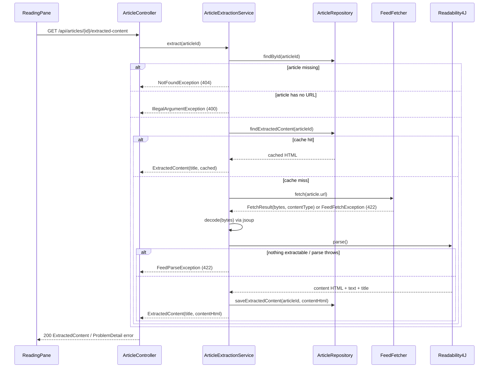

# Reader View / Content Extraction Workflow

"Reader view" reconstructs a readable article from the publisher's original page when the feed itself didn't supply usable content, or on demand when the reader wants the full page instead of the feed-supplied summary. It is a distinct cross-system workflow — frontend toggle, a dedicated controller endpoint, an extraction service, a cache column on `article`, and a retention rule — from ordinary feed polling (see [Feed Lifecycle Workflow](feed-lifecycle.md)).

## When it triggers

`ReadingPane` decides reader view per selected article:

- **Auto-enable**: `hasFeedContent = !!(article.content || article.summary)`. If the article has neither, `readerView` defaults to `true` — the feed gave the app nothing to show, so the app fetches the original page instead.
- **Manual toggle**: a "📖 Reader View" / "📖 Feed View" toolbar button lets the reader override the automatic choice for the currently open article (`readerViewChoice`, state `boolean | null`; `null` means "follow auto").
- The manual override is **per-article**: selecting a different article resets `readerViewChoice` back to `null` (auto), so reader view never silently carries over to an unrelated article.

`useExtractedArticle(article.id, readerView)` (a React Query hook) only issues the network request when `readerView` is true, and treats a cached success as permanently fresh (`staleTime: Infinity`) since the server already caches the extraction — there is no reason to refetch once the pane has it. It also disables retries: extraction failures (blocked fetch, nothing readable) are deterministic, so retrying client-side would just repeat the same failure.

## Request flow


*Request flow from the reading pane's reader-view toggle to the cached or freshly extracted article HTML.*

1. **Frontend**: `GET /api/articles/{id}/extracted-content` (`articlesApi.getExtractedContent`, called by `useExtractedArticle`).
2. **Controller**: `ArticleController.extractedContent` delegates directly to `ArticleExtractionService.extract(id)` and returns its `ExtractedContent` (or lets a thrown exception propagate to `GlobalExceptionHandler`).
3. **Service — lookup and validation**: `ArticleExtractionService.extract`:
   - loads the `Article` via `articleRepository.findById`, throwing `NotFoundException` if it doesn't exist;
   - requires a non-blank `article.url`, throwing `IllegalArgumentException` otherwise (there is nothing to extract from an article with no source link).
4. **Cache check**: `articleRepository.findExtractedContent(articleId)` reads the `article.extracted_content` column directly (bypassing the `Article` entity — see below). A non-null value is returned immediately as `ExtractedContent(article.getTitle(), cached)`, with **no** re-fetch of the original page.
5. **Cache miss — fetch**: `feedFetcher.fetch(article.url)` performs an **unconditional** GET, reusing the same `FeedFetcher` used for feed polling and subscription (see [Feed Lifecycle Workflow](feed-lifecycle.md)). This reuse means the reader-view fetch inherits, for free, the same guards that protect every other outbound fetch in the app:
   - **SSRF guard** (`FeedUrlValidator`): rejects non-`http(s)` schemes and loopback/link-local/RFC1918/any-local/multicast/ULA/CGNAT resolved addresses.
   - **Size cap** (`DEFAULT_MAX_FEED_BYTES`, 10 MiB): a response body larger than the cap throws `FeedFetchException` instead of buffering unbounded.
   - Any HTTP 4xx/5xx from the origin page also throws `FeedFetchException`.
6. **Charset decode**: `ArticleExtractionService.decode` picks the charset in this order: the HTTP response's declared `Content-Type` charset (`headerCharsetName`) if present, otherwise jsoup's own BOM/`<meta>`-tag charset detection (`Jsoup.parse(InputStream, charsetName, baseUri)` with a `null` charset name lets jsoup sniff it). The decoded document is re-serialized (`outerHtml()`) before being handed to Readability4J.
7. **Extraction**: `new Readability4J(article.getUrl(), html).parse()` produces an `Article` (Readability4J's own model) with `content` (HTML), `textContent` (plain text), and `title`. Two failure modes both map to `FeedParseException` (422):
   - the `parse()` call itself throws (caught and wrapped);
   - `parse()` succeeds but yields no usable content — `contentHtml == null`, `textContent == null`, or `textContent.isBlank()` (e.g. an empty `<body>`).
8. **Cache write**: on success, `articleRepository.saveExtractedContent(articleId, contentHtml)` persists the extracted HTML into `article.extracted_content` so every subsequent request for this article is served from the cache (step 4) without hitting the origin page again.
9. **Response**: `ExtractedContent(title, contentHtml)` — the extracted title if non-blank, else falling back to the article's own stored title.

## Failure mapping

`ArticleExtractionService.extract` documents and `GlobalExceptionHandler` enforces this exception-to-HTTP-status mapping:

| Exception | HTTP status | Condition |
|---|---|---|
| `NotFoundException` | 404 | no article with that id |
| `IllegalArgumentException` | 400 | article has no URL |
| `FeedFetchException` | 422 | fetching the original page failed (bad status, SSRF-blocked, or over the size cap) |
| `FeedParseException` | 422 | Readability4J threw, or extraction produced no readable content |

`FeedFetchException` and `FeedParseException` are the same exception types (and same status codes) used by the feed-polling workflow, so a client already handling those statuses for feed operations needs no new error-handling code for reader view.

## Persistence: `article.extracted_content`

`V5__article_extracted_content.sql` adds a single nullable `TEXT` column, `article.extracted_content`, to the existing `article` table. It is deliberately **not** exposed as a field on the `Article` JDBC entity — it is read and written only through two dedicated `ArticleRepository` methods:

- `findExtractedContent(Long id)` — `SELECT extracted_content FROM article WHERE id = :id`
- `saveExtractedContent(Long id, String content)` — `UPDATE article SET extracted_content = :content WHERE id = :id`

This keeps the (potentially large) cached HTML out of every ordinary `Article` read (list/detail endpoints), since only the reader-view endpoint ever needs it. See [Domain Concepts](../domain/concepts.md) for the full `Article` schema.

### Retention — no separate cron

`extracted_content` is aged out by the **same** retention job that clears `article.content`, not by a dedicated schedule:

```sql
UPDATE article SET content = NULL, extracted_content = NULL
WHERE fetched_at < :cutoff AND (content IS NOT NULL OR extracted_content IS NOT NULL)
```

`RetentionService.cleanupOldContent()` runs on `myfeeder.retention.cleanup-cron` and calls `articleRepository.clearContentOlderThan(cutoff)` with `cutoff = now - full-content-days`. Because the reader-view cache column is cleared in the same statement as `content`, there is nothing extraction-specific to schedule or monitor — see [Feed Lifecycle Workflow § Retention](feed-lifecycle.md#6-retention-separate-unrelated-cron) and [Domain Concepts](../domain/concepts.md) for the full retention rule (note `summary` is left untouched, unlike `content`/`extracted_content`).

A practical consequence: once an old article's `extracted_content` is nulled, a reader-view request for it is **not** an error — `extract` simply treats it as a fresh cache miss and re-fetches/re-extracts from the still-live origin page (subject to the same fetch/parse failure modes as any first-time extraction).

## Frontend sanitization: reader view vs. normal feed content

`ReadingPane` renders one of two HTML sources into `dangerouslySetInnerHTML`, and sanitizes them differently:

- **Normal feed-supplied content** (`article.content || article.summary`): `DOMPurify.sanitize(bodyHtml)` with default options. Feed HTML is expected to carry the publisher's inline styling as part of the article's own presentation.
- **Reader-view extracted content** (`extracted.data.contentHtml`): `DOMPurify.sanitize(html, { FORBID_TAGS: ['style'], FORBID_ATTR: ['style'] })`. Reader view exists specifically to give the user the app's own reading experience (chosen font size, theme, etc.) instead of the original page's presentation, so `<style>` elements and inline `style` attributes are stripped outright — this is what prevents a publisher's dark-background page from leaking through into the reading pane; the app theme applies uniformly regardless of the source page's CSS.

While `readerView` is true, `ReadingPane` also handles the query's pending/error states explicitly: a "Loading full article…" status while `extracted.isPending`, and a "Couldn't load the full article." message with an "↗ Open Original" fallback button while `extracted.isError` — so a 404/400/422 from the extraction endpoint degrades to a clear escape hatch rather than a blank pane.

## Tests worth knowing (`ArticleExtractionServiceTest`)

- `extractsReadableContentAndCachesIt` — feeds a fixture dark-themed HTML page through the service, asserts the extracted content contains the expected article text, contains no `<script>` tag, and that `saveExtractedContent` is called with the extracted HTML (proving the cache-write side effect).
- `returnsCachedContentWithoutRefetching` — with a non-null `findExtractedContent` result, asserts `feedFetcher` is never invoked (`verifyNoInteractions`), confirming the cache-hit short-circuit.
- `throwsNotFoundForMissingArticle`, `throwsBadRequestWhenArticleHasNoUrl` — cover the two pre-fetch validation failures.
- `throwsParseExceptionWhenNothingExtractable` — an empty `<body>` page maps to `FeedParseException`.

See [Testing Guide](../testing/guide.md) for the project's general Mockito-based service-test conventions this suite follows.
