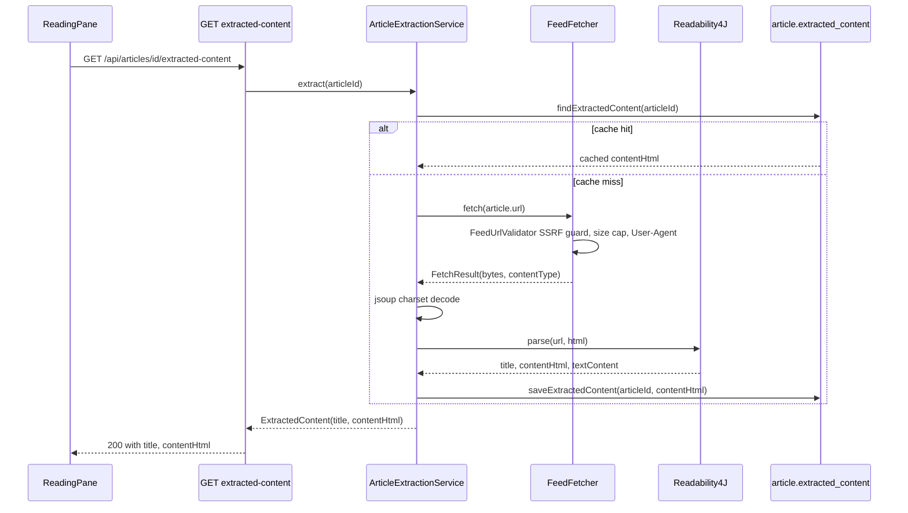

# Reader View / Article Content Extraction Workflow

Reader view lets the reading pane show an article's **original page**, extracted into
clean, theme-friendly HTML, instead of (or in addition to) whatever content/summary the
feed itself provided. This solves two problems: some feeds (e.g. TLDR-style link digests)
ship items with no body at all, and some feeds ship HTML with inline publisher styling
(dark backgrounds, custom fonts) that fights the app's own theme. This is implemented, not
backlog: `GET /api/articles/{id}/extracted-content`, `ArticleExtractionService`, the Flyway
`V5` migration, and the `ReadingPane` toggle/auto-load with DOMPurify sanitization all exist
in the current codebase.

This is a distinct workflow from feed ingestion (see
[Feed Lifecycle Workflow](feed-lifecycle.md)): it is triggered per-request by the reading
pane, not on a schedule, and it fetches the *article's own URL* rather than a feed XML/JSON
document — but it deliberately reuses `FeedFetcher`, so it inherits the same SSRF guard,
size cap, and User-Agent as feed polling rather than opening a second fetch path.

## Trigger: auto vs. manual

`ReadingPane` decides whether reader view is active per selected article
(`repo://src/main/frontend/src/components/ReadingPane.tsx#L28-L37`):

- **Auto**: `readerViewChoice` starts at `null` ("auto") for every newly selected article. In
  auto mode, reader view resolves to *on* only when the article has neither `content` nor
  `summary` (`hasFeedContent` is false) — i.e. feeds that ship empty items get the original
  page automatically.
- **Manual**: the "📖 Reader View" / "📖 Feed View" toolbar button sets an explicit
  `readerViewChoice` for the current article, overriding auto for that article only; the
  choice resets to auto (`null`) whenever `article?.id` changes.

`useExtractedArticle(article?.id ?? null, readerView)` is only enabled (`enabled: id !==
null && enabled`) when reader view is actually on, so browsing feed-content articles never
triggers an extraction fetch. The hook sets `staleTime: Infinity` and `retry: false`
(`repo://src/main/frontend/src/hooks/useArticles.ts#L24-L37`): once loaded, cached React
Query state is treated as permanent (matching the server-side cache below), and extraction
failures — which are deterministic (fetch blocked, nothing readable) — are not retried.

## Extraction pipeline

`ArticleExtractionService.extract(articleId)` is the single entrypoint, called by
`ArticleController.extractedContent`
(`repo://src/main/java/org/bartram/myfeeder/controller/ArticleController.java#L69-L72`,
`repo://src/main/java/org/bartram/myfeeder/service/ArticleExtractionService.java#L37-L65`):

1. **Load article** — `articleRepository.findById(articleId)`; missing article →
   `NotFoundException`.
2. **Validate URL** — `article.getUrl()` null/blank → `IllegalArgumentException`.
3. **Cache check** — `articleRepository.findExtractedContent(articleId)` reads the
   `extracted_content` column; a non-null cached value short-circuits the rest of the
   pipeline and returns immediately without touching `FeedFetcher` at all (verified by
   `ArticleExtractionServiceTest.returnsCachedContentWithoutRefetching`, which asserts
   `verifyNoInteractions(feedFetcher)`).
4. **Fetch** — on a cache miss, `feedFetcher.fetch(article.getUrl())` performs an
   *unconditional* GET of the article's own page through the same `FeedFetcher` used for
   feed polling, so it goes through `FeedUrlValidator`'s SSRF guard, the 10 MiB
   `DEFAULT_MAX_FEED_BYTES` cap, and the auto-configured `RestClient` User-Agent customizer
   — see [Feed Lifecycle Workflow](feed-lifecycle.md) for the details of that shared guard.
   A fetch failure (HTTP error status or body over the cap) throws `FeedFetchException`.
5. **Charset decode** — `decode()` wraps the raw bytes in `Jsoup.parse(InputStream,
   charsetName, baseUri)`: it passes the charset parsed from the response's `Content-Type`
   header when present (`headerCharsetName`), and passes `null` otherwise so jsoup falls back
   to its own BOM/meta-tag charset sniffing
   (`repo://src/main/java/org/bartram/myfeeder/service/ArticleExtractionService.java#L67-L84`).
6. **Readability4J parse** — `new Readability4J(article.getUrl(), html).parse()` (the JVM
   port of Mozilla's Readability) extracts the main article; any thrown exception is wrapped
   as `FeedParseException`. If parsing succeeds but yields a null `contentHtml`, a null
   `textContent`, or blank `textContent`, that also throws `FeedParseException` — a "200 OK
   but nothing readable" page is treated the same as a parse failure.
7. **Cache write** — `articleRepository.saveExtractedContent(articleId, contentHtml)`
   persists the extracted HTML into `article.extracted_content` so future requests hit the
   cache path in step 3.
8. **Response** — returns `ExtractedContent(title, contentHtml)`
   (`repo://src/main/java/org/bartram/myfeeder/service/ExtractedContent.java`), preferring
   Readability4J's extracted title and falling back to the feed-supplied `article.getTitle()`
   when the extracted title is null or blank.

*Reader-view request flow: on cache miss, the article page is fetched through the same
SSRF-guarded `FeedFetcher` used by feed polling, decoded, parsed by Readability4J, and
cached before the response is returned.*

## Error mapping

`GlobalExceptionHandler` maps the service's exceptions to HTTP status the same way it maps
feed-fetch/parse errors
(`repo://src/main/java/org/bartram/myfeeder/controller/GlobalExceptionHandler.java#L16-L49`):

| Condition | Exception | HTTP status |
|---|---|---|
| Article doesn't exist | `NotFoundException` | 404 |
| Article has no URL | `IllegalArgumentException` | 400 |
| Page fetch fails (HTTP error status or over size cap) | `FeedFetchException` | 422 |
| Nothing extractable (Readability4J throws, or content/text is null/blank) | `FeedParseException` | 422 |

`ReadingPane` treats any error from `useExtractedArticle` (regardless of status) the same
way in the UI: an inline "Couldn't load the full article." message with an "↗ Open
Original" fallback button, and a "Loading full article…" status while the request is
pending (`repo://src/main/frontend/src/components/ReadingPane.tsx#L195-L208`).

## Caching and lifecycle — no separate expiry path

`extracted_content` is added to `article` by
`repo://src/main/resources/db/migration/V5__article_extracted_content.sql` as a plain
`TEXT` column with no default expiry, TTL, or separate cleanup job. Once written, the cached
extraction is permanent until `RetentionService`'s content-aging job clears it: the
`@Scheduled` `cleanupOldContent()` job calls
`articleRepository.clearContentOlderThan(cutoff)`
(`repo://src/main/java/org/bartram/myfeeder/repository/ArticleRepository.java#L26-L28`),
whose `UPDATE` statement nulls `content` **and** `extracted_content` together for any
article whose `fetched_at` is older than `full-content-days` (default 30 — see
[Feed Lifecycle Workflow](feed-lifecycle.md) for the full retention job description).
Reader view therefore piggybacks entirely on the existing content-retention mechanism; there
is no reader-view-specific cache invalidation, TTL, or manual "clear cache" path. If an
article's extracted content is cleared this way, the next reader-view request simply
re-fetches and re-extracts it (subject to the same SSRF guard and size cap as any other
fetch).

## Frontend rendering and sanitization

`api/articles.ts` exposes `getExtractedContent(id)` as a plain `GET
/articles/{id}/extracted-content`
(`repo://src/main/frontend/src/api/articles.ts#L16-L17`), wrapped by the
`useExtractedArticle` query hook described above.

`ReadingPane` renders extracted HTML through `dangerouslySetInnerHTML`, but never renders
raw server output directly — both feed content and extracted content are always passed
through `DOMPurify.sanitize` first
(`repo://src/main/frontend/src/components/ReadingPane.tsx#L84-L94`). When reader view is
active, sanitization additionally passes `FORBID_TAGS: ['style']` and `FORBID_ATTR:
['style']`, which strips `<style>` elements and inline `style` attributes that Readability4J
preserved from the publisher's markup. This is the mechanism behind the "dark page becomes
light" guarantee described in the design doc: publisher styling (dark backgrounds, custom
fonts/colors) is removed entirely rather than merged with the app's theme, so the app's own
CSS is the only thing that determines colors and typography in reader view. Feed-supplied
content (non-reader-view) is sanitized with DOMPurify's defaults only, without the
style-forbidding options, since that content is not expected to carry the same
publisher-theming problem in practice.

Clicking a link inside either feed content or extracted content is intercepted
(`handleContentClick`) and opened in a new tab via `window.open(..., 'noopener')` rather than
navigating the reading pane away from the app.

## Testing

- **Backend**: `ArticleExtractionServiceTest`
  (`repo://src/test/java/org/bartram/myfeeder/service/ArticleExtractionServiceTest.java`)
  mocks `ArticleRepository` and `FeedFetcher` (no real network) and drives the service with
  an HTML fixture (`src/test/resources/pages/dark-article.html`) to assert: extraction
  produces the expected content and title, script tags are stripped, the result is persisted
  via `saveExtractedContent`, a cache hit skips `FeedFetcher` entirely
  (`verifyNoInteractions(feedFetcher)`), missing-article/no-URL/no-extractable-content each
  throw the expected exception type. See [Testing Guide](../testing/guide.md) for how this
  fits the broader "extraction/caching tests" pattern alongside controller slice tests for
  the 200/404/422 responses.
- **Frontend**: `ReadingPane.test.tsx`
  (`repo://src/main/frontend/src/components/ReadingPane.test.tsx`) mocks `useExtractedArticle`
  to cover: auto-load when the article has no content/summary (asserting the hook is called
  with `enabled=true` and that a `style` attribute on extracted HTML is stripped from the
  rendered DOM), no extraction fetch when feed content exists (`enabled=false`), switching to
  extracted content via the manual toggle, a loading state while `isPending`, and an error
  fallback message while `isError`. See [Testing Guide](../testing/guide.md) for the broader
  Vitest/React Testing Library conventions this test follows.

## Related pages

- [Feed Lifecycle Workflow](feed-lifecycle.md) — the shared `FeedFetcher`/`FeedUrlValidator`
  fetch path (SSRF guard, size cap, User-Agent) and the `RetentionService` job that clears
  `extracted_content` alongside `content`/`summary`.
- [Architecture Overview](../architecture/overview.md) — where `FeedFetcher` sits as the
  single HTTP fetch boundary.
- [Domain Concepts](../domain/concepts.md) — the `Article` entity and its columns.
- [Testing Guide](../testing/guide.md) — backend and frontend test patterns referenced above.
